# MÔ HÌNH HÓA YÊU CẦU — HỆ THỐNG QUẢN LÝ TRẠM SẠC XE ĐIỆN V-GREEN

> Tài liệu mô hình hóa yêu cầu (Requirement Modeling) cho hệ thống **V-GREEN EV Charging**.
> Bao gồm: **Use Case Model** (từ use case tổng đến từng use case con), **Activity Diagram** (biểu đồ hoạt động) và **Sequence Diagram** (biểu đồ trình tự).
>
> Các sơ đồ dùng cú pháp **Mermaid** — xem trực tiếp trên GitHub, hoặc trong VS Code/Kiro với tiện ích "Markdown Preview Mermaid Support".

---

## MỤC LỤC

1. [Phạm vi & Tác nhân (Actors)](#1-phạm-vi--tác-nhân-actors)
2. [Use Case Model](#2-use-case-model)
   - 2.1 [Use Case tổng quát toàn hệ thống](#21-use-case-tổng-quát-toàn-hệ-thống)
   - 2.2 [Gói A — Tài khoản & Xác thực](#22-gói-a--tài-khoản--xác-thực)
   - 2.3 [Gói B — Tìm kiếm & Xem trạm sạc](#23-gói-b--tìm-kiếm--xem-trạm-sạc)
   - 2.4 [Gói C — Đặt chỗ](#24-gói-c--đặt-chỗ)
   - 2.5 [Gói D — Phiên sạc](#25-gói-d--phiên-sạc)
   - 2.6 [Gói E — Hóa đơn & Thanh toán](#26-gói-e--hóa-đơn--thanh-toán)
   - 2.7 [Gói F — Ví điện tử & VNPay](#27-gói-f--ví-điện-tử--vnpay)
   - 2.8 [Gói G — Khách hàng thân thiết (Loyalty)](#28-gói-g--khách-hàng-thân-thiết-loyalty)
   - 2.9 [Gói H — Đánh giá trạm](#29-gói-h--đánh-giá-trạm)
   - 2.10 [Gói I — Phương tiện](#210-gói-i--phương-tiện)
   - 2.11 [Gói J — Thông báo](#211-gói-j--thông-báo)
   - 2.12 [Gói K — Bảo trì](#212-gói-k--bảo-trì)
   - 2.13 [Gói L — Quản trị](#213-gói-l--quản-trị)
   - 2.14 [Bảng tổng hợp toàn bộ Use Case](#214-bảng-tổng-hợp-toàn-bộ-use-case)
3. [Activity Diagrams (Biểu đồ hoạt động)](#3-activity-diagrams-biểu-đồ-hoạt-động)
4. [Sequence Diagrams (Biểu đồ trình tự)](#4-sequence-diagrams-biểu-đồ-trình-tự)

---

## 1. Phạm vi & Tác nhân (Actors)

Hệ thống V-GREEN là nền tảng vận hành và quản lý mạng lưới trạm sạc xe điện: tìm trạm, đặt chỗ, sạc, thanh toán (ví + VNPay), tích điểm, đánh giá, bảo trì và quản trị.

### Tác nhân chính (Primary Actors)

| Actor | Mô tả | Vai trò trong hệ thống |
|-------|-------|------------------------|
| **Khách vãng lai (Guest)** | Người dùng chưa đăng nhập | Đăng ký, đăng nhập, quên mật khẩu, xem bản đồ/trạm công khai |
| **Khách hàng (Customer)** | Người dùng cá nhân sở hữu xe điện | Tìm trạm, đặt chỗ, sạc, thanh toán, tích điểm, đánh giá, quản lý xe |
| **Tài xế đội xe (Driver)** | Tài xế thuộc fleet (Xanh SM, Lazada EV…) | Kế thừa toàn bộ quyền Customer + tự động hưởng chiết khấu fleet |
| **Kỹ thuật viên (Technician)** | Người sửa chữa trụ sạc | Xem & cập nhật phiếu bảo trì được phân công |
| **Quản trị viên (Admin)** | Người quản lý toàn hệ thống | Quản lý trạm, người dùng, biểu giá, voucher, fleet, doanh thu, bảo trì |

### Tác nhân phụ / Hệ thống ngoài (Secondary / External Actors)

| Actor | Mô tả |
|-------|-------|
| **Cổng thanh toán VNPay** | Xử lý nạp tiền; trả kết quả qua Return URL và IPN |
| **Bộ định thời (Cron/Scheduler)** | Kích hoạt tự động hủy đặt chỗ quá hạn & nhắc lịch sạc |
| **Dịch vụ Push (Web Push)** | Đẩy thông báo tới trình duyệt/thiết bị người dùng |

### Sơ đồ quan hệ kế thừa giữa Actor

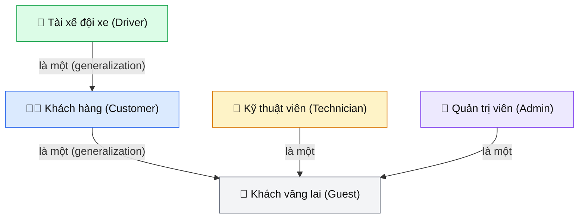
```mermaid
graph TD
    Guest["👤 Khách vãng lai (Guest)"]
    Customer["🧑‍💼 Khách hàng (Customer)"]
    Driver["🚗 Tài xế đội xe (Driver)"]
    Tech["🔧 Kỹ thuật viên (Technician)"]
    Admin["👑 Quản trị viên (Admin)"]

    Customer -->|"là một (generalization)"| Guest
    Driver -->|"là một (generalization)"| Customer
    Tech -->|"là một"| Guest
    Admin -->|"là một"| Guest

    classDef guest fill:#f3f4f6,stroke:#6b7280,color:#111;
    classDef cust fill:#dbeafe,stroke:#2563eb,color:#111;
    classDef drv fill:#dcfce7,stroke:#16a34a,color:#111;
    classDef tech fill:#fef3c7,stroke:#d97706,color:#111;
    classDef adm fill:#ede9fe,stroke:#7c3aed,color:#111;
    class Guest guest; class Customer cust; class Driver drv; class Tech tech; class Admin adm;
```

> **Ghi chú:** Driver kế thừa toàn bộ use case của Customer (quan hệ generalization). Admin và Technician sau khi đăng nhập có vùng chức năng riêng. Mọi yêu cầu sau đăng nhập đều được xác thực bằng **JWT token** kèm vai trò (role) để phân quyền.

---

## 2. Use Case Model

### 2.1 Use Case tổng quát toàn hệ thống

Sơ đồ tổng quát thể hiện các **nhóm chức năng (use case tổng)** của hệ thống và tác nhân liên quan. Mỗi nhóm sẽ được phân rã thành các use case con ở các mục 2.2 → 2.13.

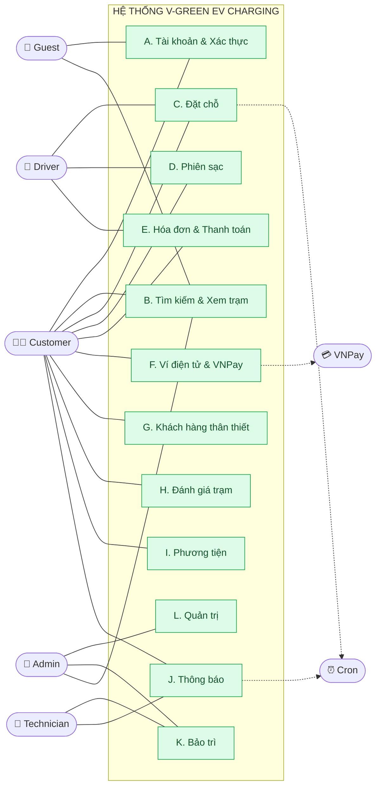
```mermaid
graph LR
    Guest(["👤 Guest"])
    Customer(["🧑‍💼 Customer"])
    Driver(["🚗 Driver"])
    Tech(["🔧 Technician"])
    Admin(["👑 Admin"])
    VNPay(["💳 VNPay"])
    Cron(["⏰ Cron"])

    subgraph SYS["HỆ THỐNG V-GREEN EV CHARGING"]
        A["A. Tài khoản & Xác thực"]
        B["B. Tìm kiếm & Xem trạm"]
        C["C. Đặt chỗ"]
        D["D. Phiên sạc"]
        E["E. Hóa đơn & Thanh toán"]
        F["F. Ví điện tử & VNPay"]
        G["G. Khách hàng thân thiết"]
        H["H. Đánh giá trạm"]
        I["I. Phương tiện"]
        J["J. Thông báo"]
        K["K. Bảo trì"]
        L["L. Quản trị"]
    end

    Guest --- A
    Guest --- B
    Customer --- A
    Customer --- B
    Customer --- C
    Customer --- D
    Customer --- E
    Customer --- F
    Customer --- G
    Customer --- H
    Customer --- I
    Customer --- J
    Driver --- C
    Driver --- D
    Driver --- E
    Tech --- K
    Tech --- J
    Admin --- L
    Admin --- K
    Admin --- B

    F -.-> VNPay
    C -.-> Cron
    J -.-> Cron

    classDef pkg fill:#dcfce7,stroke:#16a34a,color:#14532d;
    class A,B,C,D,E,F,G,H,I,J,K,L pkg;
```

**Danh sách use case tổng (gói chức năng):**

| Mã | Gói chức năng | Tác nhân chính |
|----|---------------|----------------|
| A | Quản lý tài khoản & xác thực | Guest, Customer, Admin |
| B | Tìm kiếm & xem thông tin trạm sạc | Guest, Customer, Admin |
| C | Đặt chỗ trạm sạc | Customer/Driver, Cron |
| D | Thực hiện phiên sạc | Customer/Driver |
| E | Hóa đơn & thanh toán | Customer/Driver |
| F | Ví điện tử & nạp tiền VNPay | Customer/Driver, VNPay |
| G | Khách hàng thân thiết (điểm thưởng) | Customer/Driver |
| H | Đánh giá trạm sạc | Customer, Admin |
| I | Quản lý phương tiện | Customer/Driver |
| J | Thông báo | Customer, Technician, Cron |
| K | Quản lý bảo trì | Admin, Technician |
| L | Quản trị hệ thống | Admin |

---

### 2.2 Gói A — Tài khoản & Xác thực

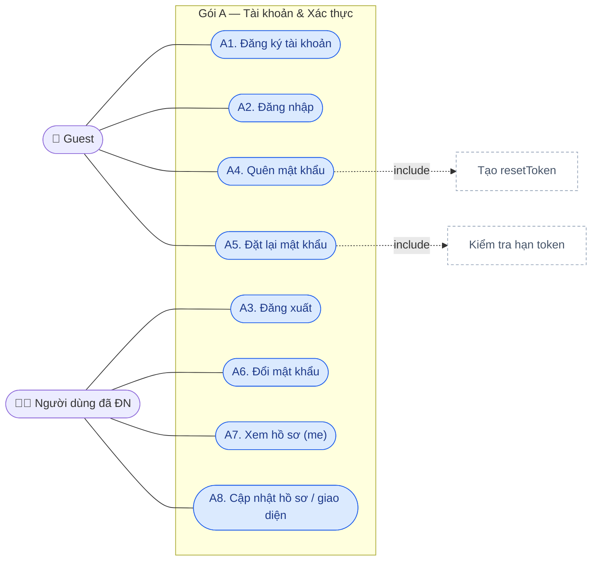
```mermaid
graph LR
    Guest(["👤 Guest"])
    User(["🧑‍💼 Người dùng đã ĐN"])

    subgraph A["Gói A — Tài khoản & Xác thực"]
        A1(["A1. Đăng ký tài khoản"])
        A2(["A2. Đăng nhập"])
        A3(["A3. Đăng xuất"])
        A4(["A4. Quên mật khẩu"])
        A5(["A5. Đặt lại mật khẩu"])
        A6(["A6. Đổi mật khẩu"])
        A7(["A7. Xem hồ sơ (me)"])
        A8(["A8. Cập nhật hồ sơ / giao diện"])
    end

    Guest --- A1
    Guest --- A2
    Guest --- A4
    Guest --- A5
    User --- A3
    User --- A6
    User --- A7
    User --- A8

    A4 -.->|"include"| A41["Tạo resetToken"]
    A5 -.->|"include"| A51["Kiểm tra hạn token"]

    classDef uc fill:#dbeafe,stroke:#2563eb,color:#1e3a8a;
    classDef inc fill:#fff,stroke:#94a3b8,color:#475569,stroke-dasharray: 4 3;
    class A1,A2,A3,A4,A5,A6,A7,A8 uc;
    class A41,A51 inc;
```

| Mã | Use case | Mô tả ngắn |
|----|----------|-----------|
| A1 | Đăng ký tài khoản | Nhập email/mật khẩu/tên/SĐT; kiểm tra trùng email; băm mật khẩu (bcrypt); tạo user role `CUSTOMER` |
| A2 | Đăng nhập | Xác thực email + mật khẩu; phát hành JWT lưu vào cookie `ev_token` |
| A3 | Đăng xuất | Xóa cookie phiên |
| A4 | Quên mật khẩu | Sinh `resetToken` + thời hạn, gửi liên kết đặt lại |
| A5 | Đặt lại mật khẩu | Kiểm tra token còn hạn; cập nhật mật khẩu mới |
| A6 | Đổi mật khẩu | Người dùng đã đăng nhập đổi mật khẩu (kiểm tra mật khẩu cũ) |
| A7 | Xem hồ sơ | Lấy thông tin người dùng hiện tại từ token |
| A8 | Cập nhật hồ sơ / giao diện | Sửa tên, SĐT, avatar, theme (light/dark) |

---

### 2.3 Gói B — Tìm kiếm & Xem trạm sạc

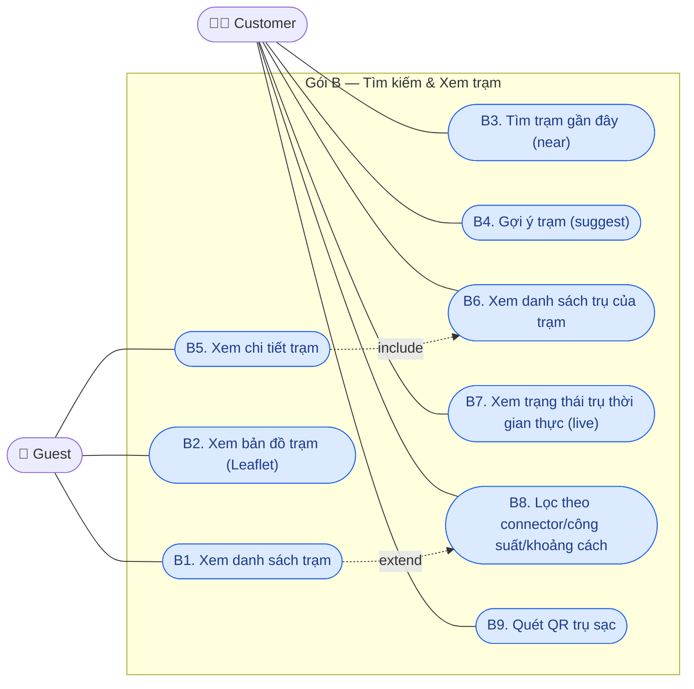
```mermaid
graph LR
    Guest(["👤 Guest"])
    Customer(["🧑‍💼 Customer"])

    subgraph B["Gói B — Tìm kiếm & Xem trạm"]
        B1(["B1. Xem danh sách trạm"])
        B2(["B2. Xem bản đồ trạm (Leaflet)"])
        B3(["B3. Tìm trạm gần đây (near)"])
        B4(["B4. Gợi ý trạm (suggest)"])
        B5(["B5. Xem chi tiết trạm"])
        B6(["B6. Xem danh sách trụ của trạm"])
        B7(["B7. Xem trạng thái trụ thời gian thực (live)"])
        B8(["B8. Lọc theo connector/công suất/khoảng cách"])
        B9(["B9. Quét QR trụ sạc"])
    end

    Guest --- B1
    Guest --- B2
    Guest --- B5
    Customer --- B3
    Customer --- B4
    Customer --- B6
    Customer --- B7
    Customer --- B8
    Customer --- B9

    B1 -.->|"extend"| B8
    B5 -.->|"include"| B6

    classDef uc fill:#dbeafe,stroke:#2563eb,color:#1e3a8a;
    classDef inc fill:#fff,stroke:#94a3b8,color:#475569,stroke-dasharray: 4 3;
    class B1,B2,B3,B4,B5,B6,B7,B8,B9 uc;
```

| Mã | Use case | Mô tả ngắn |
|----|----------|-----------|
| B1 | Xem danh sách trạm | Liệt kê trạm, kèm số trụ trống, rating |
| B2 | Xem bản đồ trạm | Bản đồ Leaflet, marker theo trạng thái (xanh/đỏ/vàng) |
| B3 | Tìm trạm gần đây | Tính khoảng cách theo tọa độ người dùng |
| B4 | Gợi ý trạm | Đề xuất trạm phù hợp (gần, còn trống) |
| B5 | Xem chi tiết trạm | Thông tin trạm, tiện ích, mô tả, ảnh, đánh giá |
| B6 | Xem danh sách trụ | Trụ + connector + công suất + trạng thái |
| B7 | Xem trạng thái trụ live | Trạng thái cập nhật (AVAILABLE/OCCUPIED/CHARGING/MAINTENANCE) |
| B8 | Lọc | Theo connector, công suất, khoảng cách |
| B9 | Quét QR trụ | Tra cứu trụ theo `qrCode` hoặc `id` để đặt/sạc nhanh |

---

### 2.4 Gói C — Đặt chỗ

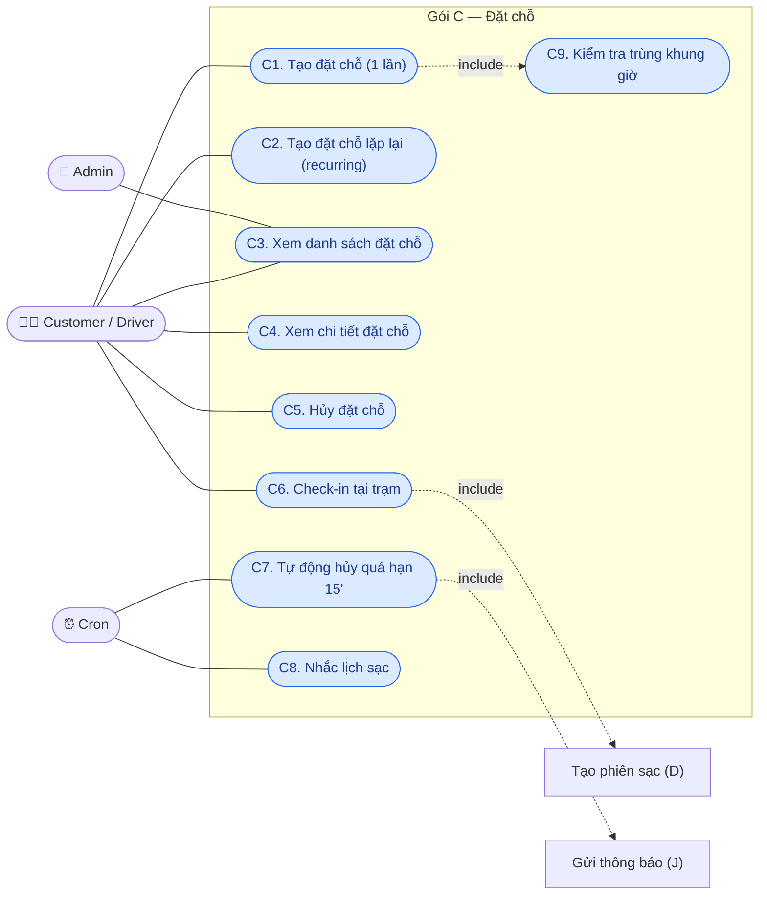
```mermaid
graph LR
    Customer(["🧑‍💼 Customer / Driver"])
    Cron(["⏰ Cron"])
    Admin(["👑 Admin"])

    subgraph C["Gói C — Đặt chỗ"]
        C1(["C1. Tạo đặt chỗ (1 lần)"])
        C2(["C2. Tạo đặt chỗ lặp lại (recurring)"])
        C3(["C3. Xem danh sách đặt chỗ"])
        C4(["C4. Xem chi tiết đặt chỗ"])
        C5(["C5. Hủy đặt chỗ"])
        C6(["C6. Check-in tại trạm"])
        C7(["C7. Tự động hủy quá hạn 15'"])
        C8(["C8. Nhắc lịch sạc"])
        C9(["C9. Kiểm tra trùng khung giờ"])
    end

    Customer --- C1
    Customer --- C2
    Customer --- C3
    Customer --- C4
    Customer --- C5
    Customer --- C6
    Admin --- C3
    Cron --- C7
    Cron --- C8

    C1 -.->|"include"| C9
    C6 -.->|"include"| D1ref["Tạo phiên sạc (D)"]
    C7 -.->|"include"| J1ref["Gửi thông báo (J)"]

    classDef uc fill:#dbeafe,stroke:#2563eb,color:#1e3a8a;
    classDef inc fill:#fff,stroke:#94a3b8,color:#475569,stroke-dasharray: 4 3;
    class C1,C2,C3,C4,C5,C6,C7,C8,C9 uc;
```

| Mã | Use case | Mô tả ngắn |
|----|----------|-----------|
| C1 | Tạo đặt chỗ | Chọn trụ + khung giờ; kiểm tra trùng (C9); tạo reservation `PENDING` |
| C2 | Đặt chỗ lặp lại | Thiết lập theo các thứ trong tuần, khung giờ, ngày bắt đầu/kết thúc |
| C3 | Xem danh sách đặt chỗ | Customer xem của mình; Admin xem tất cả |
| C4 | Xem chi tiết đặt chỗ | Kèm trạm, trụ, phiên & hóa đơn liên quan |
| C5 | Hủy đặt chỗ | Chỉ khi `PENDING/RESERVED`; chủ sở hữu hoặc Admin |
| C6 | Check-in | Trong vòng 15' từ giờ bắt đầu; chuyển `CONFIRMED` + tạo phiên + trụ `OCCUPIED` |
| C7 | Tự động hủy quá hạn | Cron quét đặt chỗ `PENDING` quá 15' → `CANCELLED` + thông báo |
| C8 | Nhắc lịch sạc | Cron gửi nhắc trước giờ sạc |
| C9 | Kiểm tra trùng khung giờ | Use case `<<include>>` chống đặt đè giờ trên cùng một trụ |

---

### 2.5 Gói D — Phiên sạc

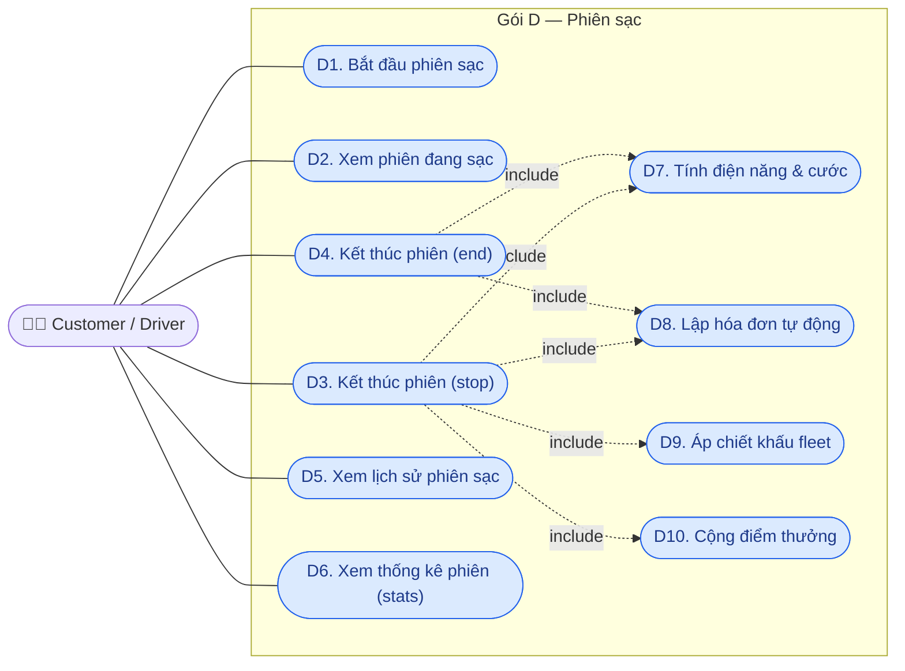
```mermaid
graph LR
    Customer(["🧑‍💼 Customer / Driver"])

    subgraph D["Gói D — Phiên sạc"]
        D1(["D1. Bắt đầu phiên sạc"])
        D2(["D2. Xem phiên đang sạc"])
        D3(["D3. Kết thúc phiên (stop)"])
        D4(["D4. Kết thúc phiên (end)"])
        D5(["D5. Xem lịch sử phiên sạc"])
        D6(["D6. Xem thống kê phiên (stats)"])
        D7(["D7. Tính điện năng & cước"])
        D8(["D8. Lập hóa đơn tự động"])
        D9(["D9. Áp chiết khấu fleet"])
        D10(["D10. Cộng điểm thưởng"])
    end

    Customer --- D1
    Customer --- D2
    Customer --- D3
    Customer --- D4
    Customer --- D5
    Customer --- D6

    D3 -.->|"include"| D7
    D3 -.->|"include"| D8
    D3 -.->|"include"| D9
    D3 -.->|"include"| D10
    D4 -.->|"include"| D7
    D4 -.->|"include"| D8

    classDef uc fill:#dbeafe,stroke:#2563eb,color:#1e3a8a;
    class D1,D2,D3,D4,D5,D6,D7,D8,D9,D10 uc;
```

| Mã | Use case | Mô tả ngắn |
|----|----------|-----------|
| D1 | Bắt đầu phiên sạc | Sau check-in; tạo `ChargingSession` `ACTIVE`; trụ chuyển `CHARGING`/`OCCUPIED` |
| D2 | Xem phiên đang sạc | Theo dõi thời gian, năng lượng ước tính |
| D3 | Kết thúc phiên (stop) | Tính kWh theo công suất × thời gian × hiệu suất; áp tariff theo giờ; chiết khấu fleet; lập hóa đơn; cộng điểm; gửi thông báo |
| D4 | Kết thúc phiên (end) | Biến thể kết thúc, lập hóa đơn `UNPAID`, cập nhật reservation `COMPLETED` |
| D5 | Lịch sử phiên sạc | Danh sách phiên đã hoàn thành |
| D6 | Thống kê phiên | Tổng kWh, chi phí, số phiên |
| D7–D10 | Use case `<<include>>` | Tính cước, lập hóa đơn, chiết khấu fleet, cộng điểm thưởng |

---

### 2.6 Gói E — Hóa đơn & Thanh toán

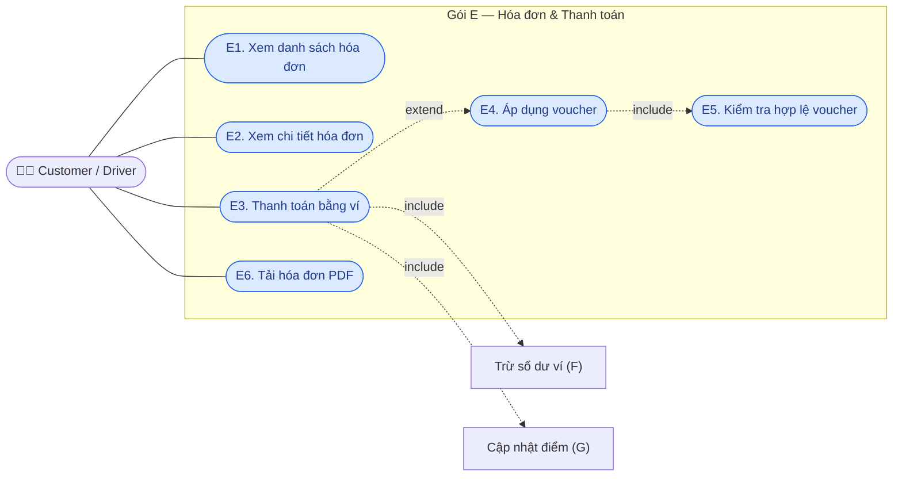
```mermaid
graph LR
    Customer(["🧑‍💼 Customer / Driver"])

    subgraph E["Gói E — Hóa đơn & Thanh toán"]
        E1(["E1. Xem danh sách hóa đơn"])
        E2(["E2. Xem chi tiết hóa đơn"])
        E3(["E3. Thanh toán bằng ví"])
        E4(["E4. Áp dụng voucher"])
        E5(["E5. Kiểm tra hợp lệ voucher"])
        E6(["E6. Tải hóa đơn PDF"])
    end

    Customer --- E1
    Customer --- E2
    Customer --- E3
    Customer --- E6

    E3 -.->|"extend"| E4
    E4 -.->|"include"| E5
    E3 -.->|"include"| F3ref["Trừ số dư ví (F)"]
    E3 -.->|"include"| G2ref["Cập nhật điểm (G)"]

    classDef uc fill:#dbeafe,stroke:#2563eb,color:#1e3a8a;
    class E1,E2,E3,E4,E5,E6 uc;
```

| Mã | Use case | Mô tả ngắn |
|----|----------|-----------|
| E1 | Xem danh sách hóa đơn | Hóa đơn của người dùng (PAID/UNPAID) |
| E2 | Xem chi tiết hóa đơn | kWh, subtotal, giảm giá, tổng, điểm |
| E3 | Thanh toán bằng ví | Kiểm tra số dư; trừ ví; ghi giao dịch; cập nhật `PAID` |
| E4 | Áp dụng voucher | `<<extend>>` E3 — giảm theo % hoặc số tiền cố định |
| E5 | Kiểm tra hợp lệ voucher | `<<include>>` — kiểm tra hạn, hạn mức, số lần dùng |
| E6 | Tải hóa đơn PDF | Xuất chứng từ hóa đơn |

---

### 2.7 Gói F — Ví điện tử & VNPay

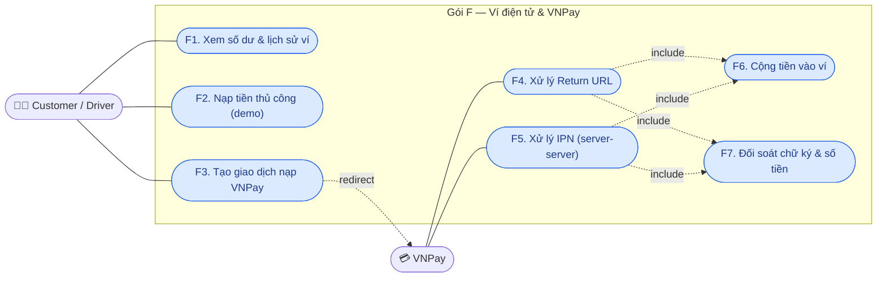
```mermaid
graph LR
    Customer(["🧑‍💼 Customer / Driver"])
    VNPay(["💳 VNPay"])

    subgraph F["Gói F — Ví điện tử & VNPay"]
        F1(["F1. Xem số dư & lịch sử ví"])
        F2(["F2. Nạp tiền thủ công (demo)"])
        F3(["F3. Tạo giao dịch nạp VNPay"])
        F4(["F4. Xử lý Return URL"])
        F5(["F5. Xử lý IPN (server-server)"])
        F6(["F6. Cộng tiền vào ví"])
        F7(["F7. Đối soát chữ ký & số tiền"])
    end

    Customer --- F1
    Customer --- F2
    Customer --- F3
    VNPay --- F4
    VNPay --- F5

    F3 -.->|"redirect"| VNPay
    F4 -.->|"include"| F7
    F5 -.->|"include"| F7
    F4 -.->|"include"| F6
    F5 -.->|"include"| F6

    classDef uc fill:#dbeafe,stroke:#2563eb,color:#1e3a8a;
    class F1,F2,F3,F4,F5,F6,F7 uc;
```

| Mã | Use case | Mô tả ngắn |
|----|----------|-----------|
| F1 | Xem ví | Số dư + lịch sử giao dịch |
| F2 | Nạp thủ công | Cộng số dư trực tiếp (môi trường demo) |
| F3 | Tạo giao dịch VNPay | Tạo `Payment` `PENDING`, sinh `txnRef`, dựng URL thanh toán |
| F4 | Xử lý Return URL | Khi người dùng quay về; xác thực; cộng ví; điều hướng kết quả |
| F5 | Xử lý IPN | VNPay gọi server-to-server; chốt giao dịch & cộng ví |
| F6 | Cộng tiền vào ví | `<<include>>` — cập nhật `Wallet` + `WalletTransaction` |
| F7 | Đối soát | `<<include>>` — kiểm tra chữ ký HMAC & số tiền khớp |

---

### 2.8 Gói G — Khách hàng thân thiết (Loyalty)

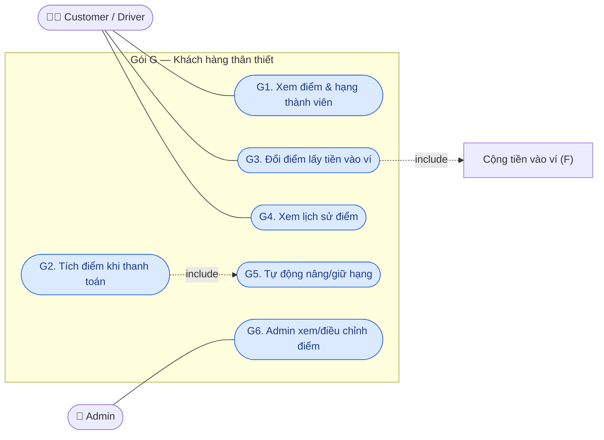
```mermaid
graph LR
    Customer(["🧑‍💼 Customer / Driver"])
    Admin(["👑 Admin"])

    subgraph G["Gói G — Khách hàng thân thiết"]
        G1(["G1. Xem điểm & hạng thành viên"])
        G2(["G2. Tích điểm khi thanh toán"])
        G3(["G3. Đổi điểm lấy tiền vào ví"])
        G4(["G4. Xem lịch sử điểm"])
        G5(["G5. Tự động nâng/giữ hạng"])
        G6(["G6. Admin xem/điều chỉnh điểm"])
    end

    Customer --- G1
    Customer --- G3
    Customer --- G4
    Admin --- G6

    G2 -.->|"include"| G5
    G3 -.->|"include"| F6ref["Cộng tiền vào ví (F)"]

    classDef uc fill:#dbeafe,stroke:#2563eb,color:#1e3a8a;
    class G1,G2,G3,G4,G5,G6 uc;
```

| Mã | Use case | Mô tả ngắn |
|----|----------|-----------|
| G1 | Xem điểm & hạng | Bronze/Silver/Gold/Platinum |
| G2 | Tích điểm | Mỗi 10.000đ = 1 điểm khi hoàn tất phiên/thanh toán |
| G3 | Đổi điểm lấy tiền | Tối thiểu 100 điểm, bội số 100; 100 điểm = 10.000đ vào ví |
| G4 | Lịch sử điểm | Giao dịch EARN/REDEEM |
| G5 | Tự động nâng hạng | `<<include>>` — tính hạng theo tổng điểm |
| G6 | Quản trị điểm | Admin xem/điều chỉnh |

---

### 2.9 Gói H — Đánh giá trạm

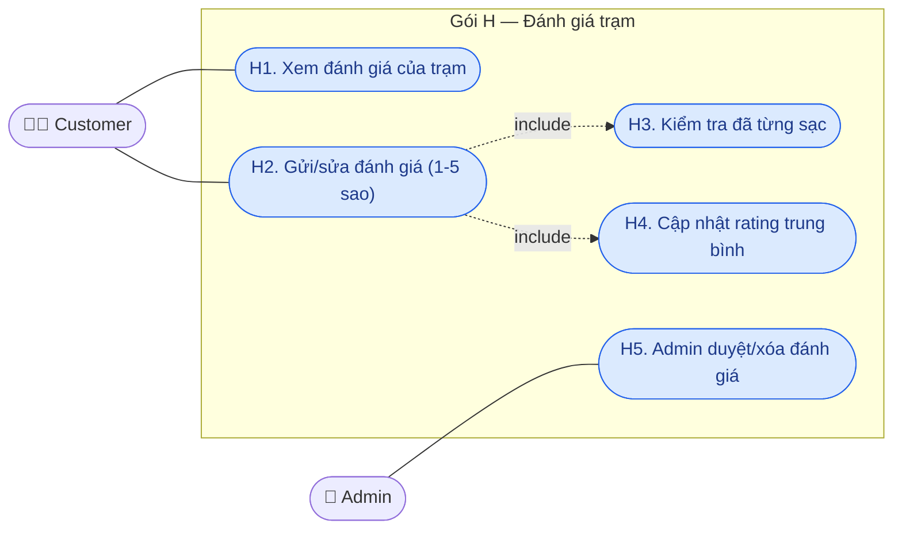
```mermaid
graph LR
    Customer(["🧑‍💼 Customer"])
    Admin(["👑 Admin"])

    subgraph H["Gói H — Đánh giá trạm"]
        H1(["H1. Xem đánh giá của trạm"])
        H2(["H2. Gửi/sửa đánh giá (1-5 sao)"])
        H3(["H3. Kiểm tra đã từng sạc"])
        H4(["H4. Cập nhật rating trung bình"])
        H5(["H5. Admin duyệt/xóa đánh giá"])
    end

    Customer --- H1
    Customer --- H2
    Admin --- H5

    H2 -.->|"include"| H3
    H2 -.->|"include"| H4

    classDef uc fill:#dbeafe,stroke:#2563eb,color:#1e3a8a;
    class H1,H2,H3,H4,H5 uc;
```

| Mã | Use case | Mô tả ngắn |
|----|----------|-----------|
| H1 | Xem đánh giá | Danh sách review + người đánh giá |
| H2 | Gửi/sửa đánh giá | 1–5 sao + nhận xét; mỗi user 1 review/trạm |
| H3 | Kiểm tra đã từng sạc | `<<include>>` — chỉ cho review nếu có phiên `COMPLETED` (verified purchase) |
| H4 | Cập nhật rating TB | `<<include>>` — tính lại rating & reviewCount của trạm |
| H5 | Admin duyệt/xóa | Kiểm duyệt nội dung review |

---

### 2.10 Gói I — Phương tiện

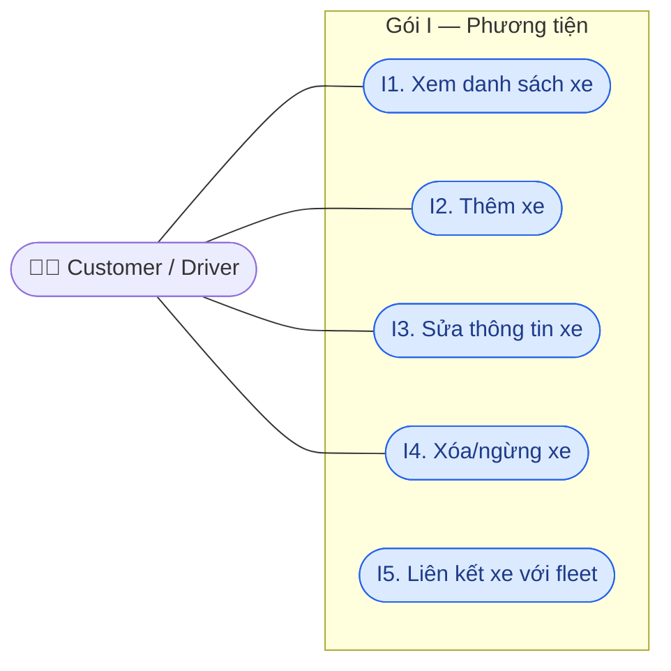
```mermaid
graph LR
    Customer(["🧑‍💼 Customer / Driver"])

    subgraph I["Gói I — Phương tiện"]
        I1(["I1. Xem danh sách xe"])
        I2(["I2. Thêm xe"])
        I3(["I3. Sửa thông tin xe"])
        I4(["I4. Xóa/ngừng xe"])
        I5(["I5. Liên kết xe với fleet"])
    end

    Customer --- I1
    Customer --- I2
    Customer --- I3
    Customer --- I4

    classDef uc fill:#dbeafe,stroke:#2563eb,color:#1e3a8a;
    class I1,I2,I3,I4,I5 uc;
```

| Mã | Use case | Mô tả ngắn |
|----|----------|-----------|
| I1 | Xem danh sách xe | Xe của người dùng |
| I2 | Thêm xe | Hãng, model, biển số, connector, dung lượng pin |
| I3 | Sửa xe | Cập nhật thông tin |
| I4 | Xóa/ngừng xe | Đặt `active=false` |
| I5 | Liên kết fleet | Xe của driver gắn `fleetId` |

---

### 2.11 Gói J — Thông báo

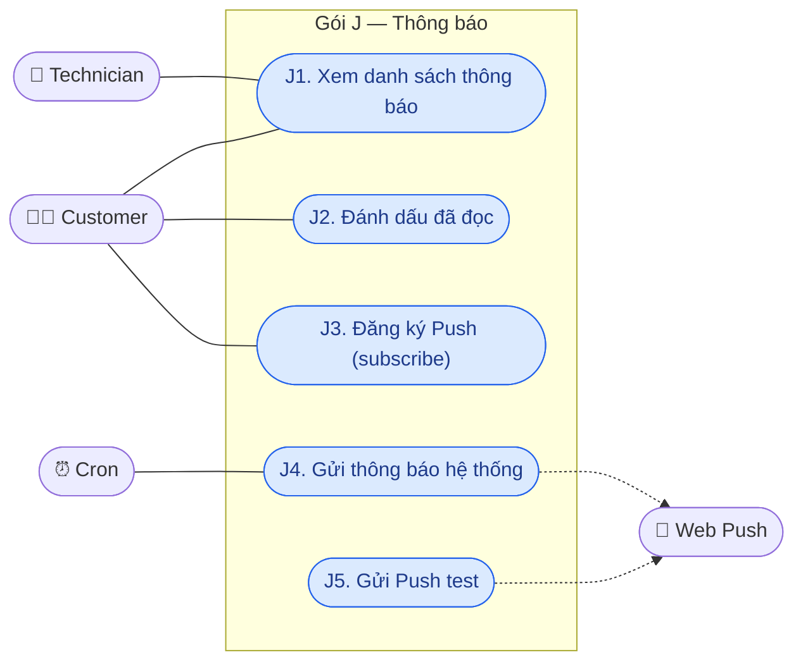
```mermaid
graph LR
    Customer(["🧑‍💼 Customer"])
    Tech(["🔧 Technician"])
    Cron(["⏰ Cron"])
    Push(["📲 Web Push"])

    subgraph J["Gói J — Thông báo"]
        J1(["J1. Xem danh sách thông báo"])
        J2(["J2. Đánh dấu đã đọc"])
        J3(["J3. Đăng ký Push (subscribe)"])
        J4(["J4. Gửi thông báo hệ thống"])
        J5(["J5. Gửi Push test"])
    end

    Customer --- J1
    Customer --- J2
    Customer --- J3
    Tech --- J1
    Cron --- J4
    J4 -.-> Push
    J5 -.-> Push

    classDef uc fill:#dbeafe,stroke:#2563eb,color:#1e3a8a;
    class J1,J2,J3,J4,J5 uc;
```

| Mã | Use case | Mô tả ngắn |
|----|----------|-----------|
| J1 | Xem thông báo | Danh sách của người dùng |
| J2 | Đánh dấu đã đọc | Cập nhật `read=true` |
| J3 | Đăng ký Push | Lưu `PushSubscription` (endpoint, khóa) |
| J4 | Gửi thông báo | Hệ thống/Cron tạo notification (lên hạng, nhắc lịch, kết thúc phiên…) |
| J5 | Push test | Kiểm thử gửi push |

---

### 2.12 Gói K — Bảo trì

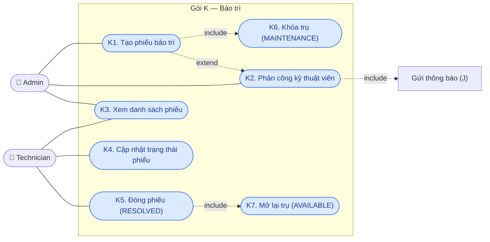
```mermaid
graph LR
    Admin(["👑 Admin"])
    Tech(["🔧 Technician"])

    subgraph K["Gói K — Bảo trì"]
        K1(["K1. Tạo phiếu bảo trì"])
        K2(["K2. Phân công kỹ thuật viên"])
        K3(["K3. Xem danh sách phiếu"])
        K4(["K4. Cập nhật trạng thái phiếu"])
        K5(["K5. Đóng phiếu (RESOLVED)"])
        K6(["K6. Khóa trụ (MAINTENANCE)"])
        K7(["K7. Mở lại trụ (AVAILABLE)"])
    end

    Admin --- K1
    Admin --- K2
    Admin --- K3
    Tech --- K3
    Tech --- K4
    Tech --- K5

    K1 -.->|"include"| K6
    K1 -.->|"extend"| K2
    K2 -.->|"include"| J4ref["Gửi thông báo (J)"]
    K5 -.->|"include"| K7

    classDef uc fill:#dbeafe,stroke:#2563eb,color:#1e3a8a;
    class K1,K2,K3,K4,K5,K6,K7 uc;
```

| Mã | Use case | Mô tả ngắn |
|----|----------|-----------|
| K1 | Tạo phiếu bảo trì | Tiêu đề, mô tả, mức ưu tiên; nếu gắn trụ → trụ `MAINTENANCE` |
| K2 | Phân công kỹ thuật viên | Gán `assignedToId` + gửi thông báo cho kỹ thuật viên |
| K3 | Xem danh sách phiếu | Admin xem tất cả; Technician chỉ xem phiếu của mình |
| K4 | Cập nhật trạng thái | OPEN → IN_PROGRESS |
| K5 | Đóng phiếu | RESOLVED + set `resolvedAt` |
| K6 | Khóa trụ | `<<include>>` — trụ về `MAINTENANCE` |
| K7 | Mở lại trụ | `<<include>>` — khi RESOLVED, trụ về `AVAILABLE`, xóa `lastError` |

---

### 2.13 Gói L — Quản trị

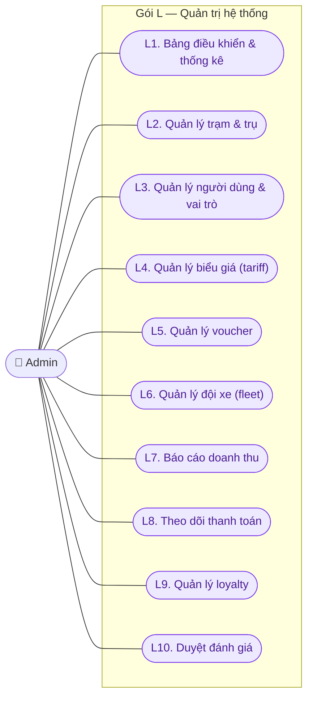
```mermaid
graph LR
    Admin(["👑 Admin"])

    subgraph L["Gói L — Quản trị hệ thống"]
        L1(["L1. Bảng điều khiển & thống kê"])
        L2(["L2. Quản lý trạm & trụ"])
        L3(["L3. Quản lý người dùng & vai trò"])
        L4(["L4. Quản lý biểu giá (tariff)"])
        L5(["L5. Quản lý voucher"])
        L6(["L6. Quản lý đội xe (fleet)"])
        L7(["L7. Báo cáo doanh thu"])
        L8(["L8. Theo dõi thanh toán"])
        L9(["L9. Quản lý loyalty"])
        L10(["L10. Duyệt đánh giá"])
    end

    Admin --- L1
    Admin --- L2
    Admin --- L3
    Admin --- L4
    Admin --- L5
    Admin --- L6
    Admin --- L7
    Admin --- L8
    Admin --- L9
    Admin --- L10

    classDef uc fill:#ede9fe,stroke:#7c3aed,color:#4c1d95;
    class L1,L2,L3,L4,L5,L6,L7,L8,L9,L10 uc;
```

| Mã | Use case | Mô tả ngắn |
|----|----------|-----------|
| L1 | Dashboard & thống kê | Tổng doanh thu, số phiên, trạm đông nhất, giờ cao điểm |
| L2 | Quản lý trạm & trụ | CRUD trạm, trụ, trạng thái |
| L3 | Quản lý người dùng | Xem, phân quyền role |
| L4 | Quản lý biểu giá | Cấu hình tariff theo giờ, cao/thấp điểm |
| L5 | Quản lý voucher | CRUD mã giảm giá, hạn mức, thời hạn |
| L6 | Quản lý fleet | Tạo đội xe, chiết khấu, gán tài xế |
| L7 | Báo cáo doanh thu | Theo ngày/tuần/tháng |
| L8 | Theo dõi thanh toán | Lịch sử Payment |
| L9 | Quản lý loyalty | Xem/điều chỉnh điểm |
| L10 | Duyệt đánh giá | Kiểm duyệt review |

---

### 2.14 Bảng tổng hợp toàn bộ Use Case

| Gói | Use case con | Actor | Liên kết (include/extend) |
|-----|--------------|-------|---------------------------|
| **A. Tài khoản** | A1 Đăng ký, A2 Đăng nhập, A3 Đăng xuất, A4 Quên MK, A5 Đặt lại MK, A6 Đổi MK, A7 Xem hồ sơ, A8 Cập nhật hồ sơ | Guest, User | A4→tạo token; A5→kiểm tra hạn |
| **B. Trạm sạc** | B1 DS trạm, B2 Bản đồ, B3 Gần đây, B4 Gợi ý, B5 Chi tiết, B6 DS trụ, B7 Live, B8 Lọc, B9 Quét QR | Guest, Customer | B5⊃B6; B1◁B8 |
| **C. Đặt chỗ** | C1 Tạo, C2 Lặp lại, C3 DS, C4 Chi tiết, C5 Hủy, C6 Check-in, C7 Tự hủy, C8 Nhắc, C9 Kiểm tra trùng | Customer/Driver, Cron, Admin | C1⊃C9; C6⊃D1; C7⊃J4 |
| **D. Phiên sạc** | D1 Bắt đầu, D2 Đang sạc, D3 Stop, D4 End, D5 Lịch sử, D6 Thống kê, D7 Tính cước, D8 Lập HĐ, D9 Chiết khấu fleet, D10 Cộng điểm | Customer/Driver | D3⊃D7,D8,D9,D10 |
| **E. Hóa đơn** | E1 DS, E2 Chi tiết, E3 Trả bằng ví, E4 Voucher, E5 Kiểm tra voucher, E6 PDF | Customer/Driver | E3◁E4; E4⊃E5; E3⊃F6,G2 |
| **F. Ví/VNPay** | F1 Xem ví, F2 Nạp demo, F3 Tạo GD VNPay, F4 Return, F5 IPN, F6 Cộng ví, F7 Đối soát | Customer, VNPay | F4,F5⊃F6,F7 |
| **G. Loyalty** | G1 Xem điểm, G2 Tích điểm, G3 Đổi điểm, G4 Lịch sử, G5 Nâng hạng, G6 Quản trị điểm | Customer/Driver, Admin | G2⊃G5; G3⊃F6 |
| **H. Đánh giá** | H1 Xem, H2 Gửi/sửa, H3 Kiểm tra đã sạc, H4 Cập nhật rating, H5 Duyệt | Customer, Admin | H2⊃H3,H4 |
| **I. Phương tiện** | I1 DS, I2 Thêm, I3 Sửa, I4 Xóa, I5 Liên kết fleet | Customer/Driver | — |
| **J. Thông báo** | J1 Xem, J2 Đã đọc, J3 Đăng ký Push, J4 Gửi, J5 Push test | Customer, Tech, Cron | — |
| **K. Bảo trì** | K1 Tạo, K2 Phân công, K3 DS, K4 Cập nhật, K5 Đóng, K6 Khóa trụ, K7 Mở trụ | Admin, Technician | K1⊃K6,◁K2; K2⊃J4; K5⊃K7 |
| **L. Quản trị** | L1 Dashboard, L2 Trạm, L3 Người dùng, L4 Tariff, L5 Voucher, L6 Fleet, L7 Doanh thu, L8 Thanh toán, L9 Loyalty, L10 Đánh giá | Admin | — |

> Ký hiệu: `⊃` = `<<include>>`, `◁` = `<<extend>>`.

---

## 3. Activity Diagrams (Biểu đồ hoạt động)

> **Quy ước UML áp dụng** (theo chuẩn Activity Diagram): mỗi biểu đồ có **một điểm bắt đầu** — Initial Node (`start`), kết thúc bằng **Activity Final Node** (`stop`); **action/activity** là hình chữ nhật bo góc (`:hành động;`); **Decision/Merge Node** là hình thoi với **điều kiện canh giữ (guard)** đặt trong `if (...) then ... else ... endif`; **Fork/Join** (`fork` / `fork again` / `end fork`) là thanh đồng bộ thể hiện các luồng chạy **song song**; vòng lặp dùng `repeat`/`while`. Các sơ đồ viết bằng **PlantUML** — có thể render bằng tiện ích "PlantUML" trong VS Code/Kiro, IntelliJ, hoặc trang [plantuml.com](https://www.plantuml.com/plantuml).

### 3.1 Activity — Đăng ký & Đăng nhập (Gói A)

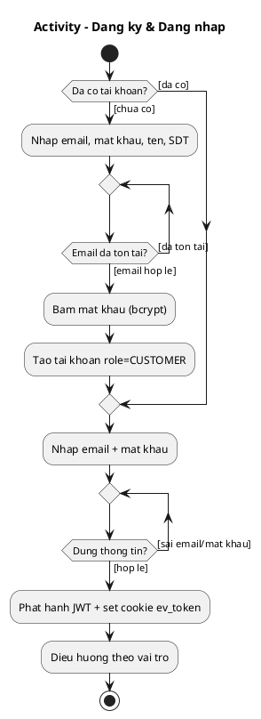
```plantuml
@startuml
title Activity - Dang ky & Dang nhap
start
if (Da co tai khoan?) then ([chua co])
  :Nhap email, mat khau, ten, SDT;
  repeat
  repeat while (Email da ton tai?) is ([da ton tai]) not ([email hop le])
  :Bam mat khau (bcrypt);
  :Tao tai khoan role=CUSTOMER;
else ([da co])
endif
:Nhap email + mat khau;
repeat
repeat while (Dung thong tin?) is ([sai email/mat khau]) not ([hop le])
:Phat hanh JWT + set cookie ev_token;
:Dieu huong theo vai tro;
stop
@enduml
```

### 3.2 Activity — Đặt chỗ → Check-in → Phiên sạc → Hóa đơn (Gói C+D+E)

Luồng nghiệp vụ cốt lõi end-to-end. Cuối luồng dùng **Fork/Join** vì các tác vụ lập hóa đơn, cộng điểm và gửi thông báo diễn ra đồng thời sau khi phiên kết thúc.

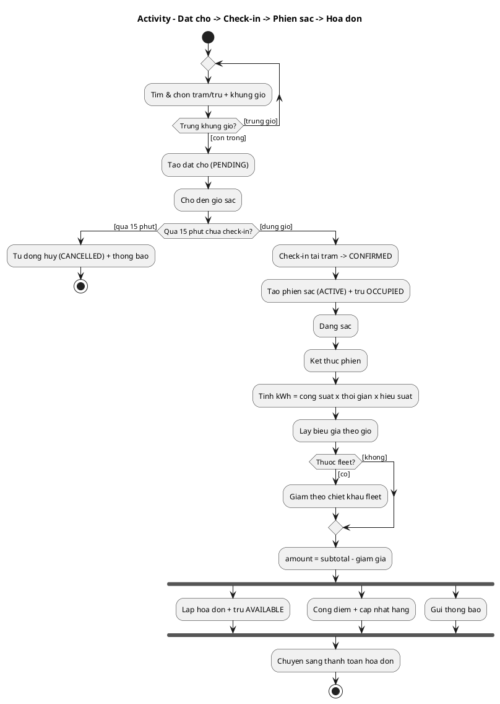
```plantuml
@startuml
title Activity - Dat cho -> Check-in -> Phien sac -> Hoa don
start
repeat
  :Tim & chon tram/tru + khung gio;
repeat while (Trung khung gio?) is ([trung gio]) not ([con trong])
:Tao dat cho (PENDING);
:Cho den gio sac;
if (Qua 15 phut chua check-in?) then ([qua 15 phut])
  :Tu dong huy (CANCELLED) + thong bao;
  stop
else ([dung gio])
  :Check-in tai tram -> CONFIRMED;
  :Tao phien sac (ACTIVE) + tru OCCUPIED;
  :Dang sac;
  :Ket thuc phien;
  :Tinh kWh = cong suat x thoi gian x hieu suat;
  :Lay bieu gia theo gio;
  if (Thuoc fleet?) then ([co])
    :Giam theo chiet khau fleet;
  else ([khong])
  endif
  :amount = subtotal - giam gia;
  fork
    :Lap hoa don + tru AVAILABLE;
  fork again
    :Cong diem + cap nhat hang;
  fork again
    :Gui thong bao;
  end fork
  :Chuyen sang thanh toan hoa don;
  stop
endif
@enduml
```

### 3.3 Activity — Thanh toán hóa đơn bằng ví + Voucher (Gói E)

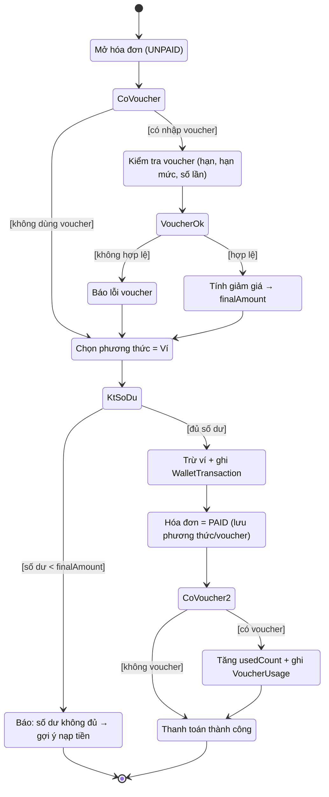
```mermaid
stateDiagram-v2
    direction TB
    [*] --> MoHD
    state "Mở hóa đơn (UNPAID)" as MoHD
    MoHD --> CoVoucher
    state CoVoucher <<choice>>
    CoVoucher --> KtVoucher: [có nhập voucher]
    CoVoucher --> ChonPT: [không dùng voucher]
    state "Kiểm tra voucher (hạn, hạn mức, số lần)" as KtVoucher
    KtVoucher --> VoucherOk
    state VoucherOk <<choice>>
    VoucherOk --> BaoLoiV: [không hợp lệ]
    VoucherOk --> TinhGiam: [hợp lệ]
    state "Báo lỗi voucher" as BaoLoiV
    BaoLoiV --> ChonPT
    state "Tính giảm giá → finalAmount" as TinhGiam
    TinhGiam --> ChonPT
    state "Chọn phương thức = Ví" as ChonPT
    ChonPT --> KtSoDu
    state KtSoDu <<choice>>
    KtSoDu --> BaoThieu: [số dư < finalAmount]
    KtSoDu --> TruVi: [đủ số dư]
    state "Báo: số dư không đủ → gợi ý nạp tiền" as BaoThieu
    BaoThieu --> [*]
    state "Trừ ví + ghi WalletTransaction" as TruVi
    TruVi --> CapNhatHD
    state "Hóa đơn = PAID (lưu phương thức/voucher)" as CapNhatHD
    CapNhatHD --> CoVoucher2
    state CoVoucher2 <<choice>>
    CoVoucher2 --> GhiVoucher: [có voucher]
    CoVoucher2 --> HoanTat: [không voucher]
    state "Tăng usedCount + ghi VoucherUsage" as GhiVoucher
    GhiVoucher --> HoanTat
    state "Thanh toán thành công" as HoanTat
    HoanTat --> [*]
```

### 3.4 Activity — Nạp tiền qua VNPay (Gói F)

Sau khi người dùng thanh toán tại VNPay, hệ thống nhận phản hồi qua **hai kênh song song** (Return URL và IPN) — thể hiện bằng **Fork/Join**.

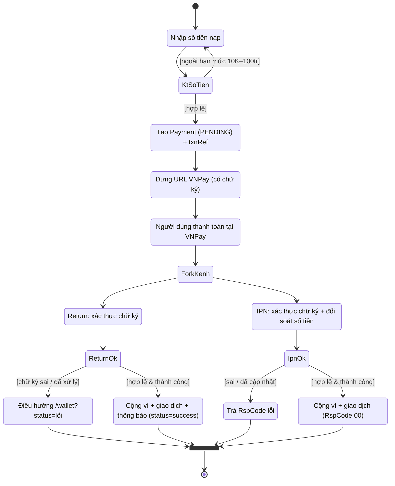
```mermaid
stateDiagram-v2
    direction TB
    [*] --> NhapTien
    state "Nhập số tiền nạp" as NhapTien
    NhapTien --> KtSoTien
    state KtSoTien <<choice>>
    KtSoTien --> NhapTien: [ngoài hạn mức 10K–100tr]
    KtSoTien --> TaoPayment: [hợp lệ]
    state "Tạo Payment (PENDING) + txnRef" as TaoPayment
    TaoPayment --> DungUrl
    state "Dựng URL VNPay (có chữ ký)" as DungUrl
    DungUrl --> ThanhToanVN
    state "Người dùng thanh toán tại VNPay" as ThanhToanVN
    ThanhToanVN --> ForkKenh
    state ForkKenh <<fork>>
    ForkKenh --> XlReturn
    ForkKenh --> XlIPN

    state "Return: xác thực chữ ký" as XlReturn
    XlReturn --> ReturnOk
    state ReturnOk <<choice>>
    ReturnOk --> ReturnLoi: [chữ ký sai / đã xử lý]
    ReturnOk --> ReturnCong: [hợp lệ & thành công]
    state "Điều hướng /wallet?status=lỗi" as ReturnLoi
    state "Cộng ví + giao dịch + thông báo (status=success)" as ReturnCong

    state "IPN: xác thực chữ ký + đối soát số tiền" as XlIPN
    XlIPN --> IpnOk
    state IpnOk <<choice>>
    IpnOk --> IpnLoi: [sai / đã cập nhật]
    IpnOk --> IpnCong: [hợp lệ & thành công]
    state "Trả RspCode lỗi" as IpnLoi
    state "Cộng ví + giao dịch (RspCode 00)" as IpnCong

    state JoinKenh <<join>>
    ReturnLoi --> JoinKenh
    ReturnCong --> JoinKenh
    IpnLoi --> JoinKenh
    IpnCong --> JoinKenh
    JoinKenh --> [*]
```

> **Lưu ý idempotent:** Cả hai kênh đều kiểm tra `status = SUCCESS` trước khi cộng ví nên tiền chỉ được cộng đúng một lần.

### 3.5 Activity — Đổi điểm thưởng lấy tiền (Gói G)

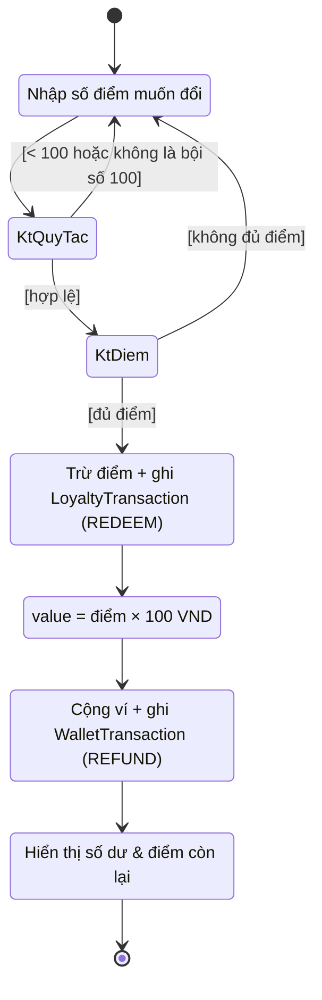
```mermaid
stateDiagram-v2
    direction TB
    [*] --> NhapDiem
    state "Nhập số điểm muốn đổi" as NhapDiem
    NhapDiem --> KtQuyTac
    state KtQuyTac <<choice>>
    KtQuyTac --> NhapDiem: [< 100 hoặc không là bội số 100]
    KtQuyTac --> KtDiem: [hợp lệ]
    state KtDiem <<choice>>
    KtDiem --> NhapDiem: [không đủ điểm]
    KtDiem --> TruDiem: [đủ điểm]
    state "Trừ điểm + ghi LoyaltyTransaction (REDEEM)" as TruDiem
    TruDiem --> TinhValue
    state "value = điểm × 100 VND" as TinhValue
    TinhValue --> CongVi
    state "Cộng ví + ghi WalletTransaction (REFUND)" as CongVi
    CongVi --> HienThi
    state "Hiển thị số dư & điểm còn lại" as HienThi
    HienThi --> [*]
```

### 3.6 Activity — Đánh giá trạm (Gói H)

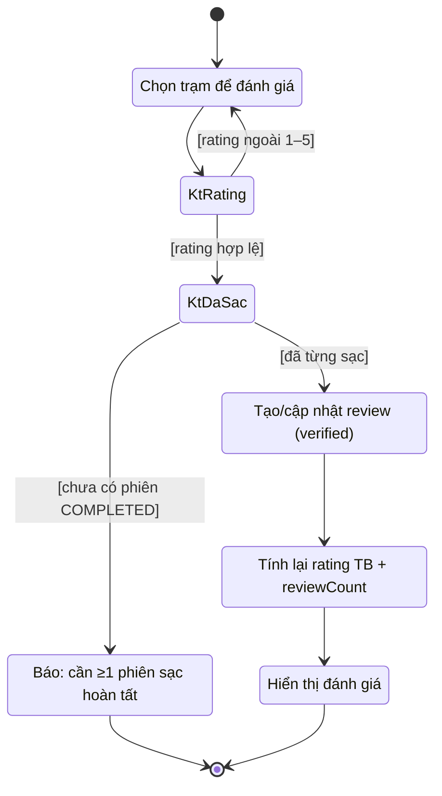
```mermaid
stateDiagram-v2
    direction TB
    [*] --> ChonTram
    state "Chọn trạm để đánh giá" as ChonTram
    ChonTram --> KtRating
    state KtRating <<choice>>
    KtRating --> ChonTram: [rating ngoài 1–5]
    KtRating --> KtDaSac: [rating hợp lệ]
    state KtDaSac <<choice>>
    KtDaSac --> BaoChua: [chưa có phiên COMPLETED]
    KtDaSac --> Upsert: [đã từng sạc]
    state "Báo: cần ≥1 phiên sạc hoàn tất" as BaoChua
    BaoChua --> [*]
    state "Tạo/cập nhật review (verified)" as Upsert
    Upsert --> TinhLai
    state "Tính lại rating TB + reviewCount" as TinhLai
    TinhLai --> HienThi
    state "Hiển thị đánh giá" as HienThi
    HienThi --> [*]
```

### 3.7 Activity — Quy trình bảo trì (Gói K)

```mermaid
stateDiagram-v2
    direction TB
    [*] --> TaoPhieu
    state "Admin: tạo phiếu bảo trì (OPEN)" as TaoPhieu
    TaoPhieu --> CoTru
    state CoTru <<choice>>
    CoTru --> KhoaTru: [gắn trụ cụ thể]
    CoTru --> KtPhanCong: [không gắn trụ]
    state "Trụ → MAINTENANCE" as KhoaTru
    KhoaTru --> KtPhanCong
    state KtPhanCong <<choice>>
    KtPhanCong --> GuiTB: [có phân công]
    KtPhanCong --> ChoPhanCong: [chưa phân công]
    state "Gửi thông báo cho kỹ thuật viên" as GuiTB
    state "Phiếu chờ phân công" as ChoPhanCong
    GuiTB --> XuLy
    ChoPhanCong --> XuLy
    state "Kỹ thuật viên: nhận & xử lý (IN_PROGRESS)" as XuLy
    XuLy --> DaSua
    state DaSua <<choice>>
    DaSua --> XuLy: [chưa xong]
    DaSua --> DongPhieu: [đã sửa xong]
    state "Đóng phiếu (RESOLVED) + resolvedAt" as DongPhieu
    DongPhieu --> CoTru2
    state CoTru2 <<choice>>
    CoTru2 --> MoTru: [phiếu gắn trụ]
    CoTru2 --> HoanTat: [không gắn trụ]
    state "Trụ → AVAILABLE, xóa lastError" as MoTru
    MoTru --> HoanTat
    state "Hoàn tất" as HoanTat
    HoanTat --> [*]
```

### 3.8 Activity — Tự động hủy đặt chỗ quá hạn (Cron, Gói C)

Vòng lặp xử lý từng phiếu (thể hiện bằng Decision/Merge Node quay vòng).

```mermaid
stateDiagram-v2
    direction TB
    [*] --> ChayCron
    state "Cron chạy mỗi 1 phút" as ChayCron
    ChayCron --> TinhMoc
    state "Tính mốc = now − 15 phút" as TinhMoc
    TinhMoc --> LayDS
    state "Lấy reservation PENDING có startTime ≤ mốc" as LayDS
    LayDS --> ConPhieu
    state ConPhieu <<choice>>
    ConPhieu --> Huy: [còn phiếu chưa xử lý]
    ConPhieu --> TraKetQua: [hết phiếu]
    state "Cập nhật CANCELLED" as Huy
    Huy --> TaoTB
    state "Tạo thông báo WARNING" as TaoTB
    TaoTB --> ConPhieu
    state "Trả về số lượng đã hủy" as TraKetQua
    TraKetQua --> [*]
```

---

## 4. Sequence Diagrams (Biểu đồ trình tự)

Các biểu đồ trình tự mô tả **các bước trao đổi theo thời gian** giữa người dùng và hệ thống, viết bằng ngôn ngữ đời thường để dễ hình dung. Để dễ đọc, chỉ dùng 4 "nhân vật" chính:

| Nhân vật | Ý nghĩa |
|----------|---------|
| **Người dùng** | Khách hàng / Tài xế / Admin / Kỹ thuật viên thao tác trên màn hình |
| **Ứng dụng** | Giao diện web/mobile mà người dùng nhìn thấy |
| **Hệ thống** | Phần xử lý nghiệp vụ phía sau (máy chủ) |
| **Cơ sở dữ liệu** | Nơi lưu trữ thông tin (tài khoản, đặt chỗ, hóa đơn…) |

Một vài luồng có thêm nhân vật ngoài như **VNPay** (cổng thanh toán), **Bộ định thời** (cron tự động chạy), **Dịch vụ Push** hoặc **Kỹ thuật viên**.

Phần này trình bày **đầy đủ biểu đồ trình tự cho toàn bộ 12 gói chức năng (A → L)**, mỗi use case quan trọng đều có một biểu đồ riêng.

---

### Gói A — Tài khoản & Xác thực

#### 4.1 Đăng ký tài khoản (A1)

```mermaid
sequenceDiagram
    actor U as Người dùng
    participant App as Ứng dụng
    participant Sys as Hệ thống
    participant DB as Cơ sở dữ liệu

    U->>App: Nhập email, mật khẩu, tên, số điện thoại
    App->>Sys: Gửi yêu cầu đăng ký
    Sys->>DB: Kiểm tra email đã tồn tại chưa
    DB-->>Sys: Trả về kết quả
    alt Email đã được dùng
        Sys-->>App: Báo email đã tồn tại
        App-->>U: Đề nghị nhập email khác
    else Email hợp lệ
        Sys->>Sys: Mã hóa mật khẩu cho an toàn
        Sys->>DB: Tạo tài khoản mới (vai trò Khách hàng)
        Sys-->>App: Đăng ký thành công
        App-->>U: Mời đăng nhập
    end
```

#### 4.2 Đăng nhập (A2)

```mermaid
sequenceDiagram
    actor U as Người dùng
    participant App as Ứng dụng
    participant Sys as Hệ thống
    participant DB as Cơ sở dữ liệu

    U->>App: Nhập email và mật khẩu
    App->>Sys: Gửi yêu cầu đăng nhập
    Sys->>DB: Tìm tài khoản theo email
    DB-->>Sys: Trả về tài khoản (nếu có)
    alt Sai email hoặc mật khẩu
        Sys-->>App: Báo đăng nhập thất bại
        App-->>U: Hiển thị thông báo lỗi
    else Thông tin đúng
        Sys->>Sys: Kiểm tra mật khẩu và tạo phiên đăng nhập
        Sys-->>App: Đăng nhập thành công
        App-->>U: Mở trang chính theo vai trò
    end
```

#### 4.3 Quên mật khẩu và đặt lại mật khẩu (A4 + A5)

```mermaid
sequenceDiagram
    actor U as Người dùng
    participant App as Ứng dụng
    participant Sys as Hệ thống
    participant DB as Cơ sở dữ liệu

    U->>App: Nhập email để lấy lại mật khẩu
    App->>Sys: Gửi yêu cầu quên mật khẩu
    Sys->>DB: Tạo mã đặt lại kèm thời hạn
    Sys-->>U: Gửi liên kết đặt lại mật khẩu (qua email)

    U->>App: Mở liên kết, nhập mật khẩu mới
    App->>Sys: Gửi yêu cầu đặt lại mật khẩu
    Sys->>DB: Kiểm tra mã còn hiệu lực
    DB-->>Sys: Trả về kết quả
    alt Mã hết hạn hoặc không đúng
        Sys-->>App: Báo liên kết không hợp lệ
        App-->>U: Đề nghị yêu cầu lại
    else Mã hợp lệ
        Sys->>DB: Cập nhật mật khẩu mới
        Sys-->>App: Đặt lại thành công
        App-->>U: Mời đăng nhập lại
    end
```

#### 4.4 Đổi mật khẩu (A6)

```mermaid
sequenceDiagram
    actor U as Người dùng
    participant App as Ứng dụng
    participant Sys as Hệ thống
    participant DB as Cơ sở dữ liệu

    U->>App: Nhập mật khẩu cũ và mật khẩu mới
    App->>Sys: Gửi yêu cầu đổi mật khẩu
    Sys->>DB: Lấy mật khẩu hiện tại để đối chiếu
    DB-->>Sys: Trả về thông tin
    alt Mật khẩu cũ không đúng
        Sys-->>App: Báo sai mật khẩu cũ
        App-->>U: Hiển thị lỗi
    else Hợp lệ
        Sys->>DB: Lưu mật khẩu mới (đã mã hóa)
        Sys-->>App: Đổi mật khẩu thành công
        App-->>U: Hiển thị xác nhận
    end
```

#### 4.5 Xem và cập nhật hồ sơ / giao diện (A7 + A8)

```mermaid
sequenceDiagram
    actor U as Người dùng
    participant App as Ứng dụng
    participant Sys as Hệ thống
    participant DB as Cơ sở dữ liệu

    U->>App: Mở trang hồ sơ cá nhân
    App->>Sys: Yêu cầu thông tin người dùng hiện tại
    Sys->>DB: Lấy hồ sơ
    DB-->>Sys: Trả về hồ sơ
    Sys-->>App: Trả về thông tin
    App-->>U: Hiển thị hồ sơ

    U->>App: Sửa tên, SĐT, ảnh đại diện, giao diện sáng/tối
    App->>Sys: Gửi thông tin cập nhật
    Sys->>DB: Lưu thay đổi
    Sys-->>App: Cập nhật thành công
    App-->>U: Hiển thị hồ sơ mới
```

#### 4.6 Đăng xuất (A3)

```mermaid
sequenceDiagram
    actor U as Người dùng
    participant App as Ứng dụng
    participant Sys as Hệ thống

    U->>App: Bấm đăng xuất
    App->>Sys: Gửi yêu cầu đăng xuất
    Sys->>Sys: Xóa phiên đăng nhập
    Sys-->>App: Đã đăng xuất
    App-->>U: Quay về trang đăng nhập
```

---

### Gói B — Tìm kiếm & Xem trạm sạc

#### 4.7 Tìm và xem danh sách trạm (B1, B2, B3, B4, B8)

```mermaid
sequenceDiagram
    actor U as Người dùng
    participant App as Ứng dụng
    participant Sys as Hệ thống
    participant DB as Cơ sở dữ liệu

    U->>App: Mở bản đồ / danh sách trạm (có thể lọc, cho phép định vị)
    App->>Sys: Yêu cầu danh sách trạm phù hợp
    Sys->>DB: Lấy các trạm theo bộ lọc và vị trí
    DB-->>Sys: Trả về danh sách trạm + số trụ trống
    Sys->>Sys: Tính khoảng cách, sắp xếp gần nhất / gợi ý
    Sys-->>App: Trả về danh sách trạm
    App-->>U: Hiển thị trên bản đồ và danh sách
```

#### 4.8 Xem chi tiết trạm và trạng thái trụ theo thời gian thực (B5, B6, B7)

```mermaid
sequenceDiagram
    actor U as Người dùng
    participant App as Ứng dụng
    participant Sys as Hệ thống
    participant DB as Cơ sở dữ liệu

    U->>App: Chọn một trạm để xem chi tiết
    App->>Sys: Yêu cầu thông tin trạm
    Sys->>DB: Lấy thông tin trạm, danh sách trụ, đánh giá
    DB-->>Sys: Trả về dữ liệu
    Sys-->>App: Trả về chi tiết trạm
    App-->>U: Hiển thị thông tin, tiện ích, đánh giá

    loop Tự động cập nhật
        App->>Sys: Hỏi trạng thái trụ mới nhất
        Sys->>DB: Lấy trạng thái trụ
        DB-->>Sys: Trống / đang sạc / bảo trì
        Sys-->>App: Trả về trạng thái
        App-->>U: Cập nhật màu trạng thái trụ
    end
```

#### 4.9 Quét mã QR trên trụ sạc (B9)

```mermaid
sequenceDiagram
    actor U as Người dùng
    participant App as Ứng dụng
    participant Sys as Hệ thống
    participant DB as Cơ sở dữ liệu

    U->>App: Quét mã QR dán trên trụ
    App->>Sys: Gửi mã vừa quét
    Sys->>DB: Tra cứu trụ theo mã
    DB-->>Sys: Trả về thông tin trụ (nếu có)
    alt Không tìm thấy trụ
        Sys-->>App: Báo không tìm thấy
        App-->>U: Đề nghị quét lại
    else Tìm thấy trụ
        Sys-->>App: Trả về thông tin trụ và trạm
        App-->>U: Hiển thị để đặt chỗ / sạc nhanh
    end
```

---

### Gói C — Đặt chỗ

#### 4.10 Tạo đặt chỗ một lần (C1 + C9)

```mermaid
sequenceDiagram
    actor U as Người dùng
    participant App as Ứng dụng
    participant Sys as Hệ thống
    participant DB as Cơ sở dữ liệu

    U->>App: Chọn trụ sạc và khung giờ muốn đặt
    App->>Sys: Gửi yêu cầu đặt chỗ
    Sys->>DB: Kiểm tra trụ có bị đặt trùng giờ không
    DB-->>Sys: Trả về kết quả kiểm tra
    alt Đã có người đặt khung giờ này
        Sys-->>App: Báo trùng giờ
        App-->>U: Đề nghị chọn giờ khác
    else Khung giờ còn trống
        Sys->>DB: Lưu đặt chỗ (chờ check-in)
        Sys-->>App: Đặt chỗ thành công
        App-->>U: Hiển thị thông tin đặt chỗ
    end
```

#### 4.11 Đặt lịch sạc lặp lại hàng tuần (C2)

```mermaid
sequenceDiagram
    actor U as Người dùng
    participant App as Ứng dụng
    participant Sys as Hệ thống
    participant DB as Cơ sở dữ liệu

    U->>App: Chọn các thứ trong tuần, khung giờ, ngày bắt đầu/kết thúc
    App->>Sys: Gửi yêu cầu đặt lịch lặp lại
    Sys->>DB: Lưu cấu hình lịch lặp lại
    Sys->>DB: Tạo trước các lượt đặt chỗ theo lịch
    Sys-->>App: Tạo lịch lặp lại thành công
    App-->>U: Hiển thị danh sách các buổi đã đặt
```

#### 4.12 Xem danh sách và chi tiết đặt chỗ (C3 + C4)

```mermaid
sequenceDiagram
    actor U as Người dùng
    participant App as Ứng dụng
    participant Sys as Hệ thống
    participant DB as Cơ sở dữ liệu

    U->>App: Mở trang "Đặt chỗ của tôi"
    App->>Sys: Yêu cầu danh sách đặt chỗ
    Sys->>DB: Lấy đặt chỗ (của người dùng; Admin xem tất cả)
    DB-->>Sys: Trả về danh sách
    Sys-->>App: Trả về danh sách
    App-->>U: Hiển thị danh sách đặt chỗ

    U->>App: Chọn một đặt chỗ để xem chi tiết
    App->>Sys: Yêu cầu chi tiết đặt chỗ
    Sys->>DB: Lấy chi tiết kèm trạm, trụ, phiên sạc, hóa đơn
    DB-->>Sys: Trả về chi tiết
    Sys-->>App: Trả về chi tiết
    App-->>U: Hiển thị đầy đủ thông tin
```

#### 4.13 Hủy đặt chỗ (C5)

```mermaid
sequenceDiagram
    actor U as Người dùng
    participant App as Ứng dụng
    participant Sys as Hệ thống
    participant DB as Cơ sở dữ liệu

    U->>App: Chọn đặt chỗ và bấm hủy
    App->>Sys: Gửi yêu cầu hủy
    Sys->>DB: Lấy đặt chỗ
    DB-->>Sys: Trả về đặt chỗ
    alt Đặt chỗ không thể hủy (đã sạc/đã hủy)
        Sys-->>App: Báo không thể hủy
        App-->>U: Hiển thị lý do
    else Còn ở trạng thái chờ
        Sys->>DB: Cập nhật trạng thái đã hủy
        Sys-->>App: Hủy thành công
        App-->>U: Cập nhật danh sách
    end
```

#### 4.14 Check-in và bắt đầu sạc (C6 → D1)

```mermaid
sequenceDiagram
    actor U as Người dùng
    participant App as Ứng dụng
    participant Sys as Hệ thống
    participant DB as Cơ sở dữ liệu

    U->>App: Quét mã QR tại trụ để check-in
    App->>Sys: Gửi yêu cầu check-in
    Sys->>DB: Lấy thông tin đặt chỗ
    DB-->>Sys: Trả về đặt chỗ
    alt Đến muộn quá 15 phút
        Sys->>DB: Hủy đặt chỗ
        Sys-->>App: Báo đã hủy do quá giờ
        App-->>U: Thông báo cần đặt lại
    else Check-in đúng giờ
        Sys->>DB: Xác nhận đặt chỗ và mở phiên sạc
        Sys->>DB: Đánh dấu trụ đang được sử dụng
        Sys-->>App: Bắt đầu sạc thành công
        App-->>U: Hiển thị màn hình đang sạc
    end
```

#### 4.15 Tự động hủy đặt chỗ quá hạn (C7 — chạy tự động)

```mermaid
sequenceDiagram
    participant Cron as Bộ định thời
    participant Sys as Hệ thống
    participant DB as Cơ sở dữ liệu
    actor U as Người dùng

    Cron->>Sys: Đến giờ kiểm tra (mỗi phút)
    Sys->>DB: Tìm đặt chỗ quá 15 phút chưa check-in
    DB-->>Sys: Trả về danh sách quá hạn
    loop Mỗi đặt chỗ quá hạn
        Sys->>DB: Cập nhật trạng thái đã hủy
        Sys->>DB: Tạo thông báo cho người dùng
        Sys-->>U: Gửi thông báo lịch đã bị hủy
    end
```

#### 4.16 Nhắc lịch sạc sắp tới (C8 — chạy tự động)

```mermaid
sequenceDiagram
    participant Cron as Bộ định thời
    participant Sys as Hệ thống
    participant DB as Cơ sở dữ liệu
    actor U as Người dùng

    Cron->>Sys: Đến giờ kiểm tra lịch sắp tới
    Sys->>DB: Tìm đặt chỗ sắp đến giờ
    DB-->>Sys: Trả về danh sách
    loop Mỗi đặt chỗ sắp tới
        Sys->>DB: Tạo thông báo nhắc lịch
        Sys-->>U: Gửi nhắc "sắp đến giờ sạc"
    end
```

---

### Gói D — Phiên sạc

#### 4.17 Xem phiên đang sạc (D2)

```mermaid
sequenceDiagram
    actor U as Người dùng
    participant App as Ứng dụng
    participant Sys as Hệ thống
    participant DB as Cơ sở dữ liệu

    U->>App: Mở màn hình phiên đang sạc
    loop Cập nhật liên tục
        App->>Sys: Hỏi tình trạng phiên sạc
        Sys->>DB: Lấy thời gian sạc và lượng điện ước tính
        DB-->>Sys: Trả về dữ liệu
        Sys-->>App: Trả về tiến độ
        App-->>U: Hiển thị thời gian, điện năng, chi phí tạm tính
    end
```

#### 4.18 Kết thúc sạc và tạo hóa đơn (D3 + D7..D10)

```mermaid
sequenceDiagram
    actor U as Người dùng
    participant App as Ứng dụng
    participant Sys as Hệ thống
    participant DB as Cơ sở dữ liệu

    U->>App: Bấm kết thúc sạc
    App->>Sys: Gửi yêu cầu dừng phiên sạc
    Sys->>DB: Lấy thông tin phiên, trụ, biểu giá theo giờ
    DB-->>Sys: Trả về dữ liệu
    Sys->>Sys: Tính lượng điện đã sạc và số tiền (giá giờ, chiết khấu fleet)
    Sys->>DB: Đóng phiên sạc và trả trụ về trạng thái trống
    Sys->>DB: Tạo hóa đơn
    Sys->>DB: Cộng điểm thưởng và cập nhật hạng thành viên
    Sys-->>App: Trả về hóa đơn và số điểm nhận được
    App-->>U: Hiển thị hóa đơn và thông báo
```

#### 4.19 Xem lịch sử và thống kê phiên sạc (D5 + D6)

```mermaid
sequenceDiagram
    actor U as Người dùng
    participant App as Ứng dụng
    participant Sys as Hệ thống
    participant DB as Cơ sở dữ liệu

    U->>App: Mở trang lịch sử sạc
    App->>Sys: Yêu cầu danh sách phiên đã hoàn thành
    Sys->>DB: Lấy lịch sử và tính tổng (kWh, chi phí, số phiên)
    DB-->>Sys: Trả về dữ liệu
    Sys-->>App: Trả về lịch sử + thống kê
    App-->>U: Hiển thị danh sách và biểu đồ tổng hợp
```

---

### Gói E — Hóa đơn & Thanh toán

#### 4.20 Xem danh sách và chi tiết hóa đơn (E1 + E2)

```mermaid
sequenceDiagram
    actor U as Người dùng
    participant App as Ứng dụng
    participant Sys as Hệ thống
    participant DB as Cơ sở dữ liệu

    U->>App: Mở trang hóa đơn
    App->>Sys: Yêu cầu danh sách hóa đơn
    Sys->>DB: Lấy hóa đơn (đã trả / chưa trả)
    DB-->>Sys: Trả về danh sách
    Sys-->>App: Trả về danh sách
    App-->>U: Hiển thị danh sách hóa đơn

    U->>App: Chọn một hóa đơn
    App->>Sys: Yêu cầu chi tiết hóa đơn
    Sys->>DB: Lấy chi tiết (kWh, giảm giá, tổng tiền, điểm)
    DB-->>Sys: Trả về chi tiết
    Sys-->>App: Trả về chi tiết
    App-->>U: Hiển thị chi tiết hóa đơn
```

#### 4.21 Thanh toán hóa đơn bằng ví, áp mã giảm giá (E3 + E4 + E5)

```mermaid
sequenceDiagram
    actor U as Người dùng
    participant App as Ứng dụng
    participant Sys as Hệ thống
    participant DB as Cơ sở dữ liệu

    U->>App: Chọn thanh toán bằng ví (kèm mã giảm giá nếu có)
    App->>Sys: Gửi yêu cầu thanh toán
    opt Có nhập mã giảm giá
        Sys->>DB: Kiểm tra mã giảm giá còn hiệu lực
        DB-->>Sys: Trả về mức giảm
        Sys->>Sys: Tính lại số tiền cần trả
    end
    Sys->>DB: Kiểm tra số dư ví
    DB-->>Sys: Trả về số dư
    alt Số dư không đủ
        Sys-->>App: Báo số dư không đủ
        App-->>U: Gợi ý nạp thêm tiền
    else Đủ số dư
        Sys->>DB: Trừ tiền trong ví và đánh dấu hóa đơn đã thanh toán
        Sys->>DB: Ghi nhận lượt dùng mã giảm giá (nếu có)
        Sys-->>App: Thanh toán thành công
        App-->>U: Hiển thị xác nhận
    end
```

#### 4.22 Tải hóa đơn PDF (E6)

```mermaid
sequenceDiagram
    actor U as Người dùng
    participant App as Ứng dụng
    participant Sys as Hệ thống
    participant DB as Cơ sở dữ liệu

    U->>App: Bấm tải hóa đơn PDF
    App->>Sys: Yêu cầu xuất hóa đơn
    Sys->>DB: Lấy dữ liệu hóa đơn
    DB-->>Sys: Trả về dữ liệu
    Sys->>Sys: Tạo file PDF hóa đơn
    Sys-->>App: Trả về file PDF
    App-->>U: Tải xuống / mở hóa đơn
```

---

### Gói F — Ví điện tử & VNPay

#### 4.23 Xem số dư và lịch sử ví (F1)

```mermaid
sequenceDiagram
    actor U as Người dùng
    participant App as Ứng dụng
    participant Sys as Hệ thống
    participant DB as Cơ sở dữ liệu

    U->>App: Mở trang ví
    App->>Sys: Yêu cầu thông tin ví
    Sys->>DB: Lấy số dư và lịch sử giao dịch
    DB-->>Sys: Trả về dữ liệu
    Sys-->>App: Trả về số dư + lịch sử
    App-->>U: Hiển thị ví và các giao dịch
```

#### 4.24 Nạp tiền vào ví qua VNPay (F3 + F4 + F5)

```mermaid
sequenceDiagram
    actor U as Người dùng
    participant App as Ứng dụng
    participant Sys as Hệ thống
    participant VNPay as VNPay
    participant DB as Cơ sở dữ liệu

    U->>App: Nhập số tiền muốn nạp
    App->>Sys: Gửi yêu cầu nạp tiền
    Sys->>DB: Tạo giao dịch chờ thanh toán
    Sys-->>App: Trả về liên kết thanh toán VNPay
    App->>VNPay: Chuyển người dùng sang VNPay
    U->>VNPay: Thanh toán tại VNPay
    VNPay->>Sys: Báo kết quả thanh toán
    alt Thanh toán thành công
        Sys->>DB: Cộng tiền vào ví và ghi nhận giao dịch
        Sys-->>U: Thông báo nạp tiền thành công
    else Thất bại
        Sys->>DB: Đánh dấu giao dịch thất bại
        Sys-->>U: Thông báo nạp tiền không thành công
    end
```

> **Ghi chú:** VNPay báo kết quả qua hai đường (trình duyệt quay về và máy chủ VNPay gọi trực tiếp). Hệ thống luôn kiểm tra trạng thái trước khi cộng tiền nên ví **chỉ được cộng đúng một lần**.

#### 4.25 Nạp tiền thủ công (F2 — môi trường demo)

```mermaid
sequenceDiagram
    actor U as Người dùng
    participant App as Ứng dụng
    participant Sys as Hệ thống
    participant DB as Cơ sở dữ liệu

    U->>App: Nhập số tiền nạp (demo)
    App->>Sys: Gửi yêu cầu nạp thủ công
    alt Số tiền không hợp lệ
        Sys-->>App: Báo lỗi số tiền
        App-->>U: Đề nghị nhập lại
    else Hợp lệ
        Sys->>DB: Cộng số dư và ghi giao dịch nạp tiền
        Sys-->>App: Nạp thành công
        App-->>U: Hiển thị số dư mới
    end
```

---

### Gói G — Khách hàng thân thiết (Loyalty)

#### 4.26 Xem điểm, hạng và lịch sử điểm (G1 + G4)

```mermaid
sequenceDiagram
    actor U as Người dùng
    participant App as Ứng dụng
    participant Sys as Hệ thống
    participant DB as Cơ sở dữ liệu

    U->>App: Mở trang khách hàng thân thiết
    App->>Sys: Yêu cầu thông tin điểm
    Sys->>DB: Lấy điểm, hạng và lịch sử tích/đổi điểm
    DB-->>Sys: Trả về dữ liệu
    Sys-->>App: Trả về điểm, hạng, lịch sử
    App-->>U: Hiển thị điểm, hạng thành viên và lịch sử
```

#### 4.27 Đổi điểm thưởng lấy tiền vào ví (G3)

```mermaid
sequenceDiagram
    actor U as Người dùng
    participant App as Ứng dụng
    participant Sys as Hệ thống
    participant DB as Cơ sở dữ liệu

    U->>App: Nhập số điểm muốn đổi
    App->>Sys: Gửi yêu cầu đổi điểm
    Sys->>DB: Kiểm tra số điểm hiện có
    DB-->>Sys: Trả về số điểm
    alt Không đủ điểm hoặc sai quy tắc (tối thiểu 100, bội số 100)
        Sys-->>App: Báo lỗi
        App-->>U: Hiển thị thông báo
    else Hợp lệ
        Sys->>DB: Trừ điểm và cộng tiền tương ứng vào ví
        Sys-->>App: Đổi điểm thành công
        App-->>U: Hiển thị số dư ví và điểm còn lại
    end
```

#### 4.28 Admin xem và điều chỉnh điểm (G6)

```mermaid
sequenceDiagram
    actor A as Admin
    participant App as Ứng dụng
    participant Sys as Hệ thống
    participant DB as Cơ sở dữ liệu

    A->>App: Mở trang quản lý loyalty, chọn người dùng
    App->>Sys: Yêu cầu thông tin điểm của người dùng
    Sys->>DB: Lấy điểm và lịch sử
    DB-->>Sys: Trả về dữ liệu
    Sys-->>App: Trả về thông tin
    A->>App: Điều chỉnh điểm (cộng/trừ) kèm lý do
    App->>Sys: Gửi yêu cầu điều chỉnh
    Sys->>DB: Cập nhật điểm và ghi lịch sử điều chỉnh
    Sys-->>App: Cập nhật thành công
    App-->>A: Hiển thị điểm mới
```

---

### Gói H — Đánh giá trạm

#### 4.29 Xem đánh giá của trạm (H1)

```mermaid
sequenceDiagram
    actor U as Người dùng
    participant App as Ứng dụng
    participant Sys as Hệ thống
    participant DB as Cơ sở dữ liệu

    U->>App: Mở phần đánh giá của một trạm
    App->>Sys: Yêu cầu danh sách đánh giá
    Sys->>DB: Lấy các đánh giá kèm người viết
    DB-->>Sys: Trả về danh sách
    Sys-->>App: Trả về danh sách đánh giá
    App-->>U: Hiển thị số sao và nhận xét
```

#### 4.30 Gửi hoặc sửa đánh giá (H2 + H3 + H4)

```mermaid
sequenceDiagram
    actor U as Người dùng
    participant App as Ứng dụng
    participant Sys as Hệ thống
    participant DB as Cơ sở dữ liệu

    U->>App: Chọn số sao và viết nhận xét
    App->>Sys: Gửi đánh giá
    Sys->>DB: Kiểm tra người dùng đã từng sạc tại trạm chưa
    DB-->>Sys: Trả về kết quả
    alt Chưa từng sạc tại trạm
        Sys-->>App: Từ chối đánh giá
        App-->>U: Báo cần hoàn thành ít nhất 1 lần sạc
    else Đã từng sạc
        Sys->>DB: Lưu đánh giá và cập nhật điểm trung bình của trạm
        Sys-->>App: Đánh giá thành công
        App-->>U: Hiển thị đánh giá
    end
```

#### 4.31 Admin duyệt hoặc xóa đánh giá (H5)

```mermaid
sequenceDiagram
    actor A as Admin
    participant App as Ứng dụng
    participant Sys as Hệ thống
    participant DB as Cơ sở dữ liệu

    A->>App: Mở trang quản lý đánh giá
    App->>Sys: Yêu cầu danh sách đánh giá
    Sys->>DB: Lấy đánh giá
    DB-->>Sys: Trả về danh sách
    Sys-->>App: Trả về danh sách
    A->>App: Duyệt hợp lệ hoặc xóa đánh giá vi phạm
    App->>Sys: Gửi yêu cầu xử lý
    Sys->>DB: Cập nhật / xóa và tính lại điểm trung bình trạm
    Sys-->>App: Xử lý thành công
    App-->>A: Cập nhật danh sách
```

---

### Gói I — Phương tiện

#### 4.32 Quản lý phương tiện: xem, thêm, sửa, xóa (I1..I5)

```mermaid
sequenceDiagram
    actor U as Người dùng
    participant App as Ứng dụng
    participant Sys as Hệ thống
    participant DB as Cơ sở dữ liệu

    U->>App: Mở danh sách xe của tôi
    App->>Sys: Yêu cầu danh sách xe
    Sys->>DB: Lấy xe của người dùng
    DB-->>Sys: Trả về danh sách
    Sys-->>App: Trả về danh sách
    App-->>U: Hiển thị danh sách xe

    U->>App: Thêm / sửa / xóa xe (hãng, model, biển số, đầu cắm, dung lượng pin)
    App->>Sys: Gửi yêu cầu thay đổi
    alt Biển số đã tồn tại
        Sys-->>App: Báo trùng biển số
        App-->>U: Đề nghị kiểm tra lại
    else Hợp lệ
        Sys->>DB: Lưu thay đổi (xe của tài xế gắn với đội xe)
        Sys-->>App: Cập nhật thành công
        App-->>U: Hiển thị danh sách xe mới
    end
```

---

### Gói J — Thông báo

#### 4.33 Xem và đánh dấu đã đọc thông báo (J1 + J2)

```mermaid
sequenceDiagram
    actor U as Người dùng
    participant App as Ứng dụng
    participant Sys as Hệ thống
    participant DB as Cơ sở dữ liệu

    U->>App: Mở trang thông báo
    App->>Sys: Yêu cầu danh sách thông báo
    Sys->>DB: Lấy thông báo của người dùng
    DB-->>Sys: Trả về danh sách
    Sys-->>App: Trả về danh sách
    App-->>U: Hiển thị thông báo (chưa đọc nổi bật)

    U->>App: Mở một thông báo
    App->>Sys: Đánh dấu đã đọc
    Sys->>DB: Cập nhật trạng thái đã đọc
    Sys-->>App: Cập nhật xong
    App-->>U: Hiển thị nội dung thông báo
```

#### 4.34 Đăng ký nhận thông báo đẩy (J3)

```mermaid
sequenceDiagram
    actor U as Người dùng
    participant App as Ứng dụng
    participant Sys as Hệ thống
    participant DB as Cơ sở dữ liệu

    U->>App: Bật nhận thông báo đẩy trên thiết bị
    App->>Sys: Gửi thông tin đăng ký thiết bị
    Sys->>DB: Lưu thông tin đăng ký push
    Sys-->>App: Đăng ký thành công
    App-->>U: Xác nhận đã bật thông báo
```

#### 4.35 Hệ thống gửi thông báo đẩy (J4)

```mermaid
sequenceDiagram
    participant Sys as Hệ thống
    participant DB as Cơ sở dữ liệu
    participant Push as Dịch vụ Push
    actor U as Người dùng

    Sys->>DB: Tạo thông báo (lên hạng, nhắc lịch, kết thúc phiên…)
    Sys->>DB: Lấy thiết bị đã đăng ký của người dùng
    DB-->>Sys: Trả về danh sách thiết bị
    Sys->>Push: Gửi nội dung thông báo
    Push-->>U: Hiển thị thông báo đẩy trên thiết bị
```

---

### Gói K — Bảo trì

#### 4.36 Tạo và phân công phiếu bảo trì (K1 + K2 + K6)

```mermaid
sequenceDiagram
    actor A as Admin
    participant App as Ứng dụng
    participant Sys as Hệ thống
    participant DB as Cơ sở dữ liệu
    actor T as Kỹ thuật viên

    A->>App: Tạo phiếu bảo trì (trạm, trụ, mức ưu tiên)
    App->>Sys: Gửi yêu cầu tạo phiếu
    Sys->>DB: Lưu phiếu bảo trì
    opt Phiếu gắn với một trụ cụ thể
        Sys->>DB: Khóa trụ để bảo trì
    end
    opt Có chỉ định kỹ thuật viên
        Sys->>DB: Lưu phân công
        Sys->>T: Gửi thông báo có phiếu mới
    end
    Sys-->>App: Tạo phiếu thành công
    App-->>A: Hiển thị phiếu đã tạo
```

#### 4.37 Xem danh sách phiếu bảo trì (K3)

```mermaid
sequenceDiagram
    actor U as Admin / Kỹ thuật viên
    participant App as Ứng dụng
    participant Sys as Hệ thống
    participant DB as Cơ sở dữ liệu

    U->>App: Mở danh sách phiếu bảo trì
    App->>Sys: Yêu cầu danh sách phiếu
    alt Là Kỹ thuật viên
        Sys->>DB: Lấy phiếu được phân công cho mình
    else Là Admin
        Sys->>DB: Lấy toàn bộ phiếu
    end
    DB-->>Sys: Trả về danh sách
    Sys-->>App: Trả về danh sách
    App-->>U: Hiển thị danh sách phiếu
```

#### 4.38 Kỹ thuật viên xử lý và đóng phiếu (K4 + K5 + K7)

```mermaid
sequenceDiagram
    actor T as Kỹ thuật viên
    participant App as Ứng dụng
    participant Sys as Hệ thống
    participant DB as Cơ sở dữ liệu

    T->>App: Cập nhật phiếu sang "Đang xử lý"
    App->>Sys: Gửi cập nhật trạng thái
    Sys->>DB: Lưu trạng thái đang xử lý
    Sys-->>App: Cập nhật xong

    T->>App: Cập nhật phiếu sang "Đã sửa xong"
    App->>Sys: Gửi cập nhật trạng thái
    Sys->>DB: Lưu trạng thái và thời điểm hoàn thành
    opt Phiếu gắn với một trụ
        Sys->>DB: Mở lại trụ về trạng thái sẵn sàng
    end
    Sys-->>App: Cập nhật thành công
    App-->>T: Hiển thị phiếu đã đóng
```

---

### Gói L — Quản trị

#### 4.39 Xem bảng điều khiển và thống kê (L1 + L7 + L8)

```mermaid
sequenceDiagram
    actor A as Admin
    participant App as Ứng dụng
    participant Sys as Hệ thống
    participant DB as Cơ sở dữ liệu

    A->>App: Mở bảng điều khiển quản trị
    App->>Sys: Yêu cầu số liệu tổng hợp
    Sys->>DB: Tính doanh thu, số phiên, trạm đông nhất, giờ cao điểm
    DB-->>Sys: Trả về số liệu
    Sys-->>App: Trả về thống kê + báo cáo doanh thu + lịch sử thanh toán
    App-->>A: Hiển thị biểu đồ và bảng số liệu
```

#### 4.40 Quản lý dữ liệu hệ thống — trạm, người dùng, biểu giá, voucher, fleet (L2..L6)

```mermaid
sequenceDiagram
    actor A as Admin
    participant App as Ứng dụng
    participant Sys as Hệ thống
    participant DB as Cơ sở dữ liệu

    A->>App: Chọn mục cần quản lý (trạm/trụ, người dùng, biểu giá, voucher, đội xe)
    App->>Sys: Yêu cầu danh sách
    Sys->>DB: Lấy dữ liệu tương ứng
    DB-->>Sys: Trả về danh sách
    Sys-->>App: Trả về danh sách
    App-->>A: Hiển thị danh sách

    A->>App: Thêm / sửa / xóa hoặc phân quyền
    App->>Sys: Gửi yêu cầu thay đổi
    alt Dữ liệu không hợp lệ (trùng mã, sai định dạng…)
        Sys-->>App: Báo lỗi
        App-->>A: Đề nghị nhập lại
    else Hợp lệ
        Sys->>DB: Lưu thay đổi
        Sys-->>App: Cập nhật thành công
        App-->>A: Hiển thị dữ liệu mới
    end
```

> **Lưu ý:** Biểu đồ 4.40 áp dụng chung cho các thao tác **Quản lý trạm & trụ (L2)**, **Quản lý người dùng & vai trò (L3)**, **Quản lý biểu giá (L4)**, **Quản lý voucher (L5)** và **Quản lý đội xe/fleet (L6)** vì chúng có cùng dạng luồng thêm/sửa/xóa dữ liệu. Khi gán tài xế vào fleet, mọi lần sạc của tài xế sẽ tự động được áp chiết khấu của đội xe.

---

> **Tổng kết:** Tài liệu đã mô hình hóa đầy đủ từ **use case tổng** (12 gói chức năng A→L) xuống **từng use case con** (~75 use case), kèm **8 biểu đồ hoạt động** (Activity Diagram) cho các luồng nghiệp vụ chính và **40 biểu đồ trình tự** (Sequence Diagram) bao phủ toàn bộ 12 gói chức năng, viết bằng ngôn ngữ dễ hiểu. Các quan hệ `<<include>>`, `<<extend>>`, generalization giữa actor đều được thể hiện rõ ràng.
