# PHÂN TÍCH THIẾT KẾ HỆ THỐNG — V-GREEN EV CHARGING

> **Đồ án:** Hệ thống quản lý trạm sạc xe điện V-GREEN
> **Nội dung:** Mô hình hóa yêu cầu (Use Case + Activity Diagram), Biểu đồ trình tự (Sequence Diagram), Biểu đồ lớp chi tiết (Class Diagram)
> **Công nghệ:** Next.js 14 + TypeScript + Prisma ORM + SQLite
> **Quy ước:** Use Case Diagram & Activity Diagram dùng **PlantUML**; Sequence Diagram & Class Diagram dùng **Mermaid**

---

## MỤC LỤC

1. [Mô hình hóa yêu cầu](#1-mô-hình-hóa-yêu-cầu)
   - 1.1 [Tác nhân (Actors)](#11-tác-nhân-actors)
   - 1.2 [Use Case Diagram — Tổng quát](#12-use-case-diagram--tổng-quát)
   - 1.3 [Use Case Diagram — Chi tiết từng gói](#13-use-case-diagram--chi-tiết-từng-gói)
   - 1.4 [Đặc tả Use Case](#14-đặc-tả-use-case)
   - 1.5 [Activity Diagrams](#15-activity-diagrams)
2. [Biểu đồ trình tự — Sequence Diagrams](#2-biểu-đồ-trình-tự--sequence-diagrams)
3. [Biểu đồ lớp chi tiết — Class Diagram](#3-biểu-đồ-lớp-chi-tiết--class-diagram)
4. [Phụ lục: Kiến trúc tổng thể](#4-phụ-lục-kiến-trúc-tổng-thể)

---

## 1. MÔ HÌNH HÓA YÊU CẦU

### 1.1 Tác nhân (Actors)

| Actor | Loại | Mô tả |
|-------|------|-------|
| **Khách vãng lai** | Primary | Người dùng chưa đăng nhập, chỉ xem thông tin công khai |
| **Khách hàng** | Primary | Người dùng cá nhân sở hữu xe điện, sử dụng đầy đủ dịch vụ |
| **Tài xế đội xe** | Primary | Tài xế thuộc doanh nghiệp (fleet), kế thừa quyền Khách hàng và hưởng chiết khấu |
| **Kỹ thuật viên** | Primary | Nhân viên sửa chữa, xử lý phiếu bảo trì được phân công |
| **Quản trị viên** | Primary | Người quản lý toàn bộ hệ thống |
| **Cổng thanh toán VNPay** | Secondary | Hệ thống bên ngoài xử lý nạp tiền qua sandbox |
| **Bộ định thời** | Secondary | Cron job tự động hủy đặt chỗ quá hạn và nhắc lịch sạc |
| **Dịch vụ thông báo đẩy** | Secondary | Web Push API gửi thông báo tới trình duyệt |

**Quan hệ kế thừa giữa Actor:**

```
Tài xế đội xe  ——▷  Khách hàng  ——▷  Khách vãng lai
Kỹ thuật viên  ——▷  Khách vãng lai
Quản trị viên  ——▷  Khách vãng lai
```

> **Giải thích:** Tài xế đội xe có toàn bộ chức năng của Khách hàng và thêm quyền lợi fleet. Quản trị viên và Kỹ thuật viên sau khi đăng nhập có vùng chức năng riêng biệt.

---

### 1.2 Use Case Diagram — Tổng quát

Sơ đồ tổng quát thể hiện toàn bộ **nhóm chức năng** của hệ thống và tác nhân liên quan.

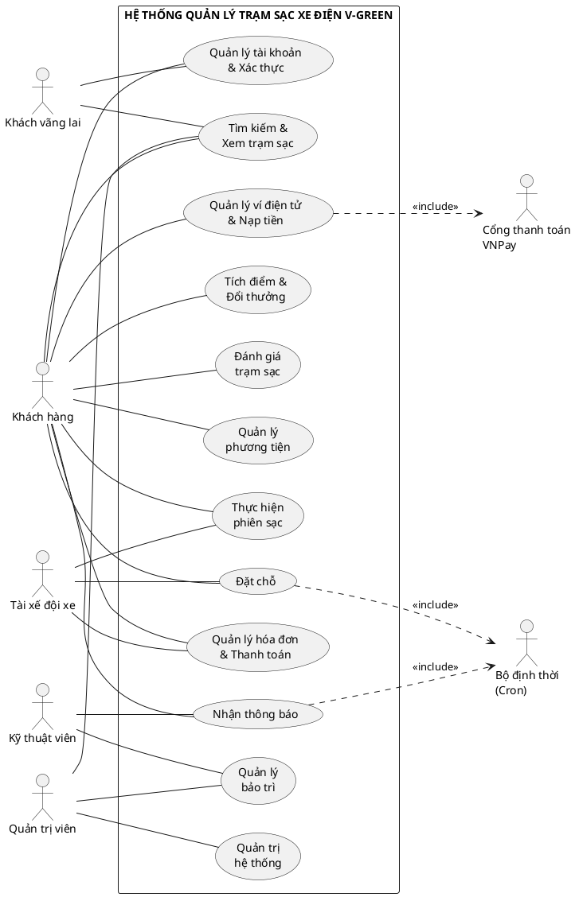

**Danh sách nhóm chức năng:**

| Mã | Nhóm chức năng | Tác nhân chính | Số UC con |
|----|---------------|----------------|-----------|
| A | Quản lý tài khoản & Xác thực | Khách vãng lai, Khách hàng | 8 |
| B | Tìm kiếm & Xem trạm sạc | Khách vãng lai, Khách hàng | 9 |
| C | Đặt chỗ | Khách hàng, Tài xế đội xe | 9 |
| D | Thực hiện phiên sạc | Khách hàng, Tài xế đội xe | 10 |
| E | Quản lý hóa đơn & Thanh toán | Khách hàng, Tài xế đội xe | 6 |
| F | Quản lý ví điện tử & Nạp tiền | Khách hàng, Cổng thanh toán | 7 |
| G | Tích điểm & Đổi thưởng | Khách hàng, Quản trị viên | 6 |
| H | Đánh giá trạm sạc | Khách hàng, Quản trị viên | 5 |
| I | Quản lý phương tiện | Khách hàng, Tài xế đội xe | 4 |
| J | Nhận thông báo | Tất cả người dùng | 4 |
| K | Quản lý bảo trì | Quản trị viên, Kỹ thuật viên | 6 |
| L | Quản trị hệ thống | Quản trị viên | 8 |

---

### 1.3 Use Case Diagram — Chi tiết từng gói

#### Gói A — Quản lý tài khoản & Xác thực

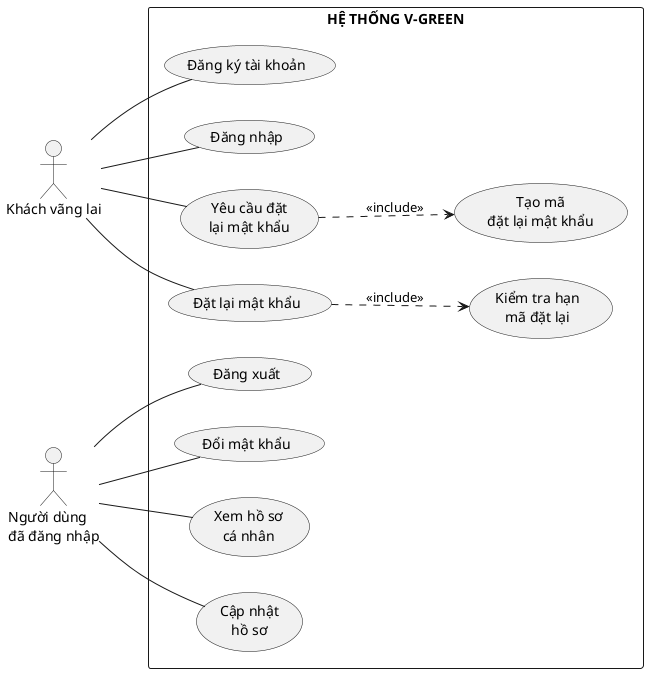

---

#### Gói B — Tìm kiếm & Xem trạm sạc

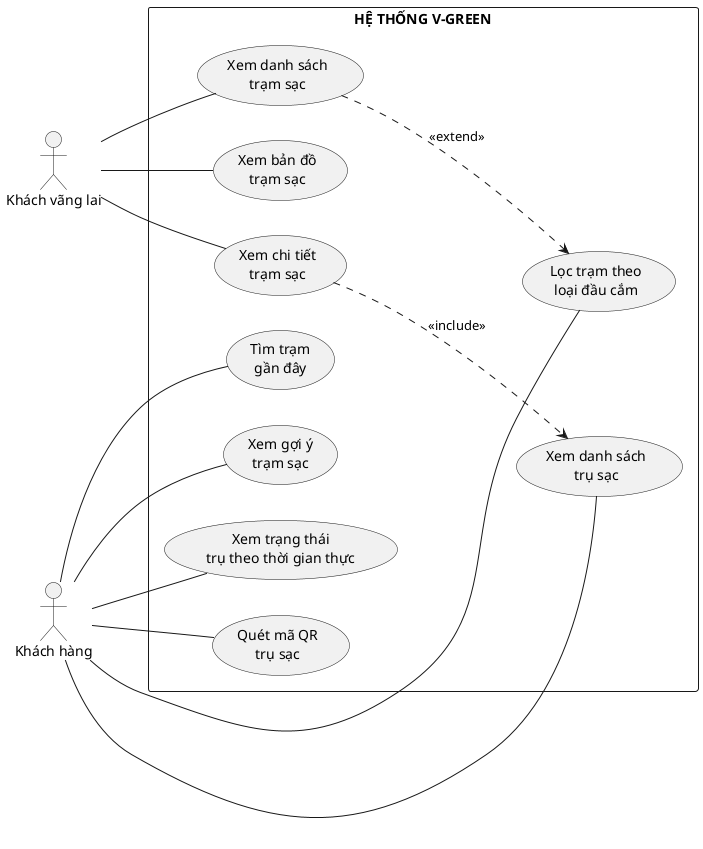

---

#### Gói C — Đặt chỗ

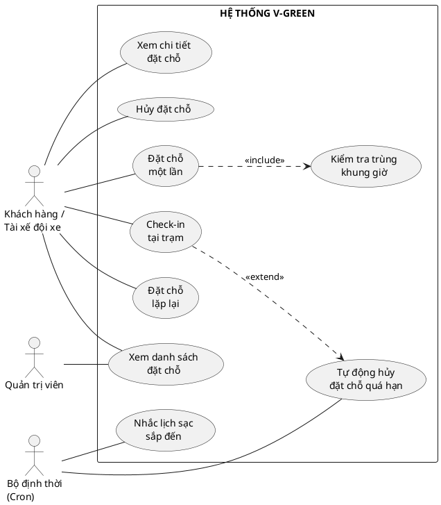

> **Giải thích include/extend:**
> - `C1 <<include>> C9`: Khi đặt chỗ, **bắt buộc** phải kiểm tra trùng khung giờ.
> - `C6 <<extend>> C7`: Khi check-in quá hạn 15 phút, hệ thống **có thể** tự động hủy.

---

#### Gói D — Thực hiện phiên sạc

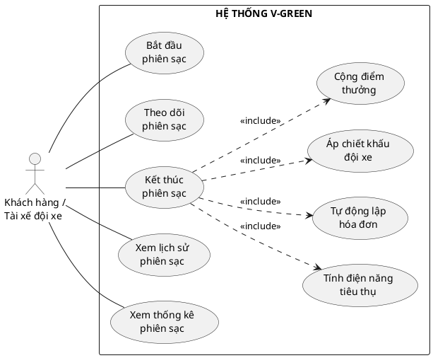

> **Giải thích:** Khi kết thúc phiên sạc (D3), hệ thống **luôn luôn** thực hiện: tính điện năng, lập hóa đơn, áp chiết khấu (nếu có fleet), cộng điểm thưởng. Đây là các bước bắt buộc → dùng `<<include>>`.

---

#### Gói E — Quản lý hóa đơn & Thanh toán

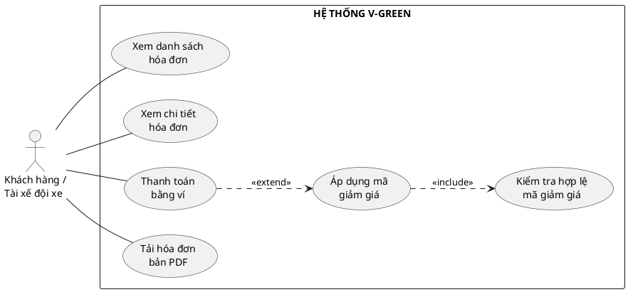

> **Giải thích:**
> - `E3 <<extend>> E4`: Khi thanh toán, người dùng **có thể** áp mã giảm giá (không bắt buộc).
> - `E4 <<include>> E5`: Khi áp mã, **bắt buộc** phải kiểm tra hợp lệ.

---

#### Gói F — Quản lý ví điện tử & Nạp tiền

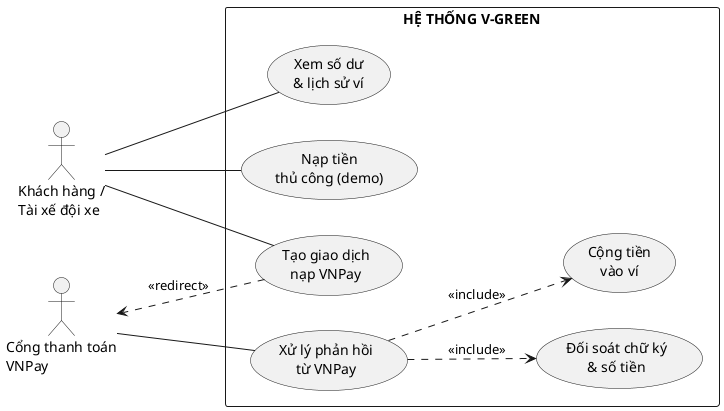

> **Giải thích:** Khi VNPay gửi phản hồi (Return URL hoặc IPN), hệ thống **bắt buộc** phải đối soát chữ ký (F5) và cộng tiền vào ví (F6).

---

#### Gói G — Tích điểm & Đổi thưởng

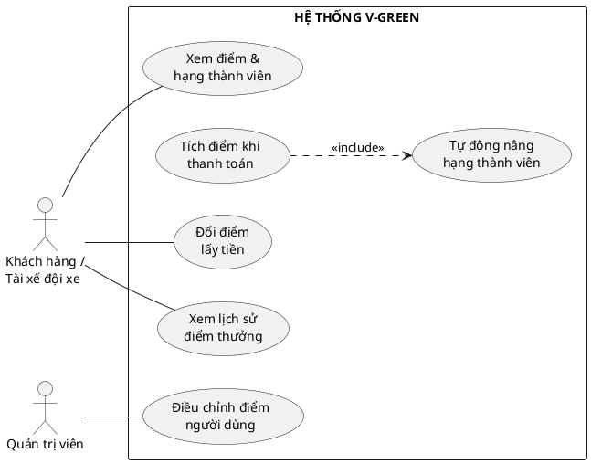

> **Giải thích:** Khi tích điểm (G2), hệ thống **bắt buộc** phải tính lại hạng thành viên (G5).

---

#### Gói H — Đánh giá trạm sạc

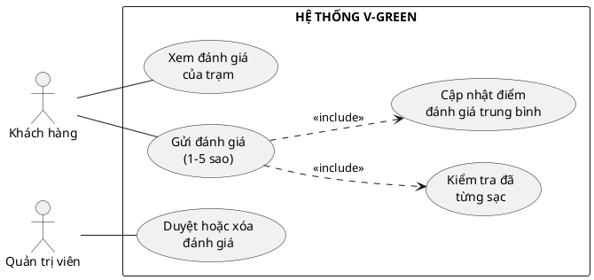

> **Giải thích:** Khi gửi đánh giá, hệ thống **bắt buộc** kiểm tra người dùng đã từng sạc (H3) và cập nhật điểm trung bình của trạm (H4).

---

#### Gói K — Quản lý bảo trì

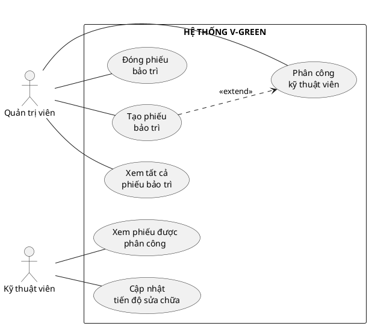

> **Giải thích:** Khi tạo phiếu bảo trì (K1), Quản trị viên **có thể** phân công kỹ thuật viên ngay (K2). Phiếu vẫn được tạo nếu chưa phân công → dùng `<<extend>>`.

---

#### Gói L — Quản trị hệ thống

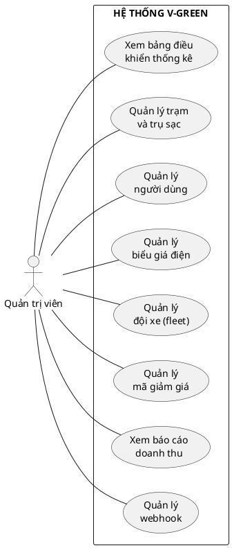

---

### 1.4 Đặc tả Use Case

#### Bảng tổng hợp toàn bộ Use Case

| Mã | Use Case | Tác nhân | Mô tả ngắn | API Route |
|----|----------|----------|-----------|-----------|
| **A — Quản lý tài khoản & Xác thực** |
| A1 | Đăng ký tài khoản | Khách vãng lai | Nhập email/mật khẩu/tên/SĐT; kiểm tra trùng email; băm mật khẩu (bcrypt); tạo user role `CUSTOMER` | `POST /api/auth/register` |
| A2 | Đăng nhập | Khách vãng lai | Xác thực email + mật khẩu; phát hành JWT (7 ngày) lưu vào cookie `ev_token` | `POST /api/auth/login` |
| A3 | Đăng xuất | Người dùng đã ĐN | Xóa cookie phiên | `POST /api/auth/logout` |
| A4 | Yêu cầu đặt lại mật khẩu | Khách vãng lai | Sinh `resetToken` + thời hạn (1h), gửi liên kết đặt lại | `POST /api/auth/forgot-password` |
| A5 | Đặt lại mật khẩu | Khách vãng lai | Kiểm tra token hợp lệ + còn hạn; cập nhật mật khẩu mới | `POST /api/auth/reset-password` |
| A6 | Đổi mật khẩu | Người dùng đã ĐN | Xác thực mật khẩu cũ, cập nhật mật khẩu mới | `POST /api/auth/change-password` |
| A7 | Xem hồ sơ cá nhân | Người dùng đã ĐN | Lấy thông tin người dùng hiện tại từ JWT | `GET /api/auth/me` |
| A8 | Cập nhật hồ sơ | Người dùng đã ĐN | Sửa tên, SĐT, avatar, theme (light/dark) | `PATCH /api/auth/me` |
| **B — Tìm kiếm & Xem trạm sạc** |
| B1 | Xem danh sách trạm sạc | Khách vãng lai | Liệt kê trạm, kèm số trụ trống, đánh giá | `GET /api/stations` |
| B2 | Xem bản đồ trạm sạc | Khách vãng lai | Bản đồ Leaflet, marker theo trạng thái (xanh/đỏ/vàng) | `/stations` (page) |
| B3 | Tìm trạm gần đây | Khách hàng | Tính khoảng cách theo tọa độ, lọc ≤ bán kính | `GET /api/stations/near` |
| B4 | Xem gợi ý trạm sạc | Khách hàng | Đề xuất trạm phù hợp (gần, còn trống, rating cao) | `GET /api/stations/suggest` |
| B5 | Xem chi tiết trạm sạc | Khách vãng lai | Thông tin trạm, tiện ích, mô tả, ảnh, đánh giá | `GET /api/stations/[id]` |
| B6 | Xem danh sách trụ sạc | Khách hàng | Trụ + loại đầu cắm + công suất + trạng thái | `GET /api/stations/[id]/slots` |
| B7 | Xem trạng thái trụ theo thời gian thực | Khách hàng | Trạng thái cập nhật: AVAILABLE/OCCUPIED/CHARGING/MAINTENANCE | `GET /api/stations/live` |
| B8 | Lọc trạm theo loại đầu cắm | Khách vãng lai | `<<extend>>` B1 — lọc theo connectorType, công suất | Query param |
| B9 | Quét mã QR trụ sạc | Khách hàng | Tra cứu trụ theo `qrCode` để đặt/sạc nhanh | `GET /api/slots/qr/[code]` |
| **C — Đặt chỗ** |
| C1 | Đặt chỗ một lần | Khách hàng | Chọn trụ + khung giờ; kiểm tra trùng (C9); tạo reservation `PENDING` | `POST /api/reservations` |
| C2 | Đặt chỗ lặp lại | Khách hàng | Thiết lập theo thứ trong tuần, khung giờ, ngày BD/KT | `POST /api/reservations/recurring` |
| C3 | Xem danh sách đặt chỗ | Khách hàng, Admin | Customer xem của mình; Admin xem tất cả | `GET /api/reservations` |
| C4 | Xem chi tiết đặt chỗ | Khách hàng | Kèm trạm, trụ, phiên & hóa đơn liên quan | `GET /api/reservations/[id]` |
| C5 | Hủy đặt chỗ | Khách hàng | Chỉ khi `PENDING/RESERVED`; chủ sở hữu hoặc Admin | `DELETE /api/reservations/[id]` |
| C6 | Check-in tại trạm | Khách hàng | Trong vòng 15' từ giờ bắt đầu; chuyển `CONFIRMED` + tạo phiên sạc | `POST /api/reservations/[id]/checkin` |
| C7 | Tự động hủy đặt chỗ quá hạn | Bộ định thời | Cron quét mỗi phút: đặt chỗ `PENDING` quá 15' → `CANCELLED` + thông báo | `GET /api/cron/expire-reservations` |
| C8 | Nhắc lịch sạc sắp đến | Bộ định thời | Cron gửi nhắc trước giờ sạc | `GET /api/cron/reservation-reminder` |
| C9 | Kiểm tra trùng khung giờ | Hệ thống | `<<include>>` — chống đặt đè giờ trên cùng một trụ | Nội bộ C1 |
| **D — Thực hiện phiên sạc** |
| D1 | Bắt đầu phiên sạc | Khách hàng | Sau check-in; tạo `ChargingSession` `ACTIVE`; trụ → `CHARGING`/`OCCUPIED` | `POST /api/sessions/[id]/start` |
| D2 | Theo dõi phiên sạc | Khách hàng | Theo dõi thời gian, năng lượng ước tính | `GET /api/sessions/[id]` |
| D3 | Kết thúc phiên sạc | Khách hàng | Tính kWh; áp tariff; chiết khấu fleet; lập hóa đơn; cộng điểm | `POST /api/sessions/[id]/stop` |
| D4 | Xem lịch sử phiên sạc | Khách hàng | Danh sách phiên đã hoàn thành | `GET /api/sessions` |
| D5 | Xem thống kê phiên sạc | Khách hàng | Tổng kWh, chi phí, số phiên | `GET /api/sessions/stats` |
| D6 | Tính điện năng tiêu thụ | Hệ thống | `<<include>>` D3 — kWh = giờ × công suất × 0.9 | Nội bộ D3 |
| D7 | Tự động lập hóa đơn | Hệ thống | `<<include>>` D3 — tạo Invoice `UNPAID` | Nội bộ D3 |
| D8 | Áp chiết khấu đội xe | Hệ thống | `<<include>>` D3 — giảm theo fleet.discountRate nếu là Driver | Nội bộ D3 |
| D9 | Cộng điểm thưởng | Hệ thống | `<<include>>` D3 — floor(amount / 10000) điểm | Nội bộ D3 |
| **E — Quản lý hóa đơn & Thanh toán** |
| E1 | Xem danh sách hóa đơn | Khách hàng | Hóa đơn của người dùng (PAID/UNPAID) | `GET /api/invoices` |
| E2 | Xem chi tiết hóa đơn | Khách hàng | kWh, subtotal, giảm giá, tổng, điểm | `GET /api/invoices/[id]` |
| E3 | Thanh toán bằng ví | Khách hàng | Kiểm tra số dư; trừ ví; ghi giao dịch; cập nhật `PAID` | `POST /api/invoices/[id]/pay` |
| E4 | Áp dụng mã giảm giá | Khách hàng | `<<extend>>` E3 — giảm theo % hoặc số tiền cố định | Query E3 |
| E5 | Kiểm tra hợp lệ mã giảm giá | Hệ thống | `<<include>>` E4 — kiểm tra hạn, hạn mức, số lần dùng | Nội bộ E4 |
| E6 | Tải hóa đơn bản PDF | Khách hàng | Xuất chứng từ hóa đơn | `GET /api/invoices/[id]/pdf` |
| **F — Quản lý ví điện tử & Nạp tiền** |
| F1 | Xem số dư & lịch sử ví | Khách hàng | Số dư + danh sách giao dịch | `GET /api/wallet` |
| F2 | Nạp tiền thủ công (demo) | Khách hàng | Cộng số dư trực tiếp (môi trường phát triển) | `POST /api/wallet/topup` |
| F3 | Tạo giao dịch nạp VNPay | Khách hàng | Tạo `Payment` `PENDING`, sinh `txnRef`, dựng URL thanh toán | `POST /api/payments/vnpay/create` |
| F4 | Xử lý phản hồi từ VNPay | Cổng thanh toán | Nhận Return URL + IPN; xác thực; cộng ví | `GET /api/payments/vnpay/return` |
| F5 | Đối soát chữ ký & số tiền | Hệ thống | `<<include>>` F4 — kiểm tra HMAC-SHA512 & số tiền khớp | Nội bộ F4 |
| F6 | Cộng tiền vào ví | Hệ thống | `<<include>>` F4 — cập nhật Wallet + WalletTransaction | Nội bộ F4 |
| **G — Tích điểm & Đổi thưởng** |
| G1 | Xem điểm & hạng thành viên | Khách hàng | BRONZE/SILVER/GOLD/PLATINUM | `GET /api/loyalty` |
| G2 | Tích điểm khi thanh toán | Hệ thống | `<<include>>` D3 — mỗi 10.000đ = 1 điểm | Nội bộ D3 |
| G3 | Đổi điểm lấy tiền | Khách hàng | Tối thiểu 100 điểm, bội số 100; 100 điểm = 10.000đ | `POST /api/loyalty/redeem` |
| G4 | Xem lịch sử điểm thưởng | Khách hàng | Giao dịch EARN/REDEEM/ADJUST | `GET /api/loyalty` |
| G5 | Tự động nâng hạng thành viên | Hệ thống | `<<include>>` G2 — tính hạng theo tổng điểm | Nội bộ G2 |
| G6 | Điều chỉnh điểm người dùng | Quản trị viên | Admin xem/điều chỉnh điểm của user bất kỳ | `GET/POST /api/admin/loyalty` |
| **H — Đánh giá trạm sạc** |
| H1 | Xem đánh giá của trạm | Khách hàng | Danh sách đánh giá + rating trung bình | `GET /api/stations/[id]/reviews` |
| H2 | Gửi đánh giá (1-5 sao) | Khách hàng | Chỉ user đã từng sạc; mỗi user 1 đánh giá/trạm | `POST /api/stations/[id]/reviews` |
| H3 | Kiểm tra đã từng sạc | Hệ thống | `<<include>>` H2 — xác thực user có session tại trạm | Nội bộ H2 |
| H4 | Cập nhật điểm đánh giá trung bình | Hệ thống | `<<include>>` H2 — tính lại rating trung bình của Station | Nội bộ H2 |
| H5 | Duyệt hoặc xóa đánh giá | Quản trị viên | Admin kiểm duyệt nội dung đánh giá | `DELETE /api/admin/reviews/[id]` |
| **I — Quản lý phương tiện** |
| I1 | Thêm phương tiện | Khách hàng | Đăng ký xe: hãng, mẫu, biển số, loại đầu cắm | `POST /api/vehicles` |
| I2 | Xem danh sách phương tiện | Khách hàng | Xe cá nhân + xe thuộc fleet | `GET /api/vehicles` |
| I3 | Cập nhật phương tiện | Khách hàng | Sửa thông tin xe | `PUT /api/vehicles/[id]` |
| I4 | Xóa phương tiện | Khách hàng | Chỉ xóa xe không thuộc fleet đang hoạt động | `DELETE /api/vehicles/[id]` |
| **K — Quản lý bảo trì** |
| K1 | Tạo phiếu bảo trì | Quản trị viên | Chọn trạm, trụ (nếu có); tiêu đề + mô tả + mức ưu tiên | `POST /api/maintenance` |
| K2 | Phân công kỹ thuật viên | Quản trị viên | `<<extend>>` K1 — gán `assignedToId` | Query K1 |
| K3 | Xem tất cả phiếu bảo trì | Quản trị viên | Danh sách đầy đủ, lọc theo trạng thái/trạm | `GET /api/maintenance` |
| K4 | Xem phiếu được phân công | Kỹ thuật viên | Chỉ xem phiếu có `assignedToId = mình` | `GET /api/maintenance` |
| K5 | Cập nhật tiến độ sửa chữa | Kỹ thuật viên | Chuyển trạng thái: OPEN → IN_PROGRESS → RESOLVED | `PATCH /api/maintenance/[id]` |
| K6 | Đóng phiếu bảo trì | Quản trị viên | Xác nhận đã sửa xong → CLOSED + trụ AVAILABLE | `PATCH /api/maintenance/[id]` |
| **L — Quản trị hệ thống** |
| L1 | Xem bảng điều khiển thống kê | Quản trị viên | Tổng quan: users, stations, revenue, sessions | `GET /api/admin/stats` |
| L2 | Quản lý trạm và trụ sạc | Quản trị viên | Thêm/sửa/xóa Station, Slot | `GET/POST /api/admin/stations` |
| L3 | Quản lý người dùng | Quản trị viên | Xem danh sách, đổi role, khóa/mở khóa | `GET /api/admin/users` |
| L4 | Quản lý biểu giá điện | Quản trị viên | Thêm/sửa/xóa Tariff theo khung giờ | `GET/POST /api/tariffs` |
| L5 | Quản lý đội xe (fleet) | Quản trị viên | Tạo fleet, set discountRate, thêm/xóa driver | `GET/POST /api/admin/fleets` |
| L6 | Quản lý mã giảm giá | Quản trị viên | Tạo/sửa/vô hiệu Voucher | `/admin/vouchers` (page) |
| L7 | Xem báo cáo doanh thu | Quản trị viên | Theo ngày/tuần/tháng, theo trạm | `GET /api/admin/revenue` |
| L8 | Quản lý webhook | Quản trị viên | Đăng ký endpoint nhận sự kiện (session.end, v.v.) | `GET/POST /api/webhooks` |

---

### 1.5 Activity Diagrams

#### 1.5.1 Luồng tổng thể: Đặt chỗ → Check-in → Sạc → Thanh toán

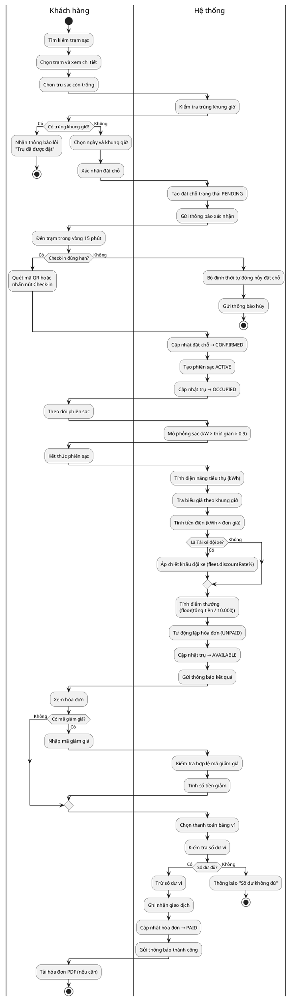

---

#### 1.5.2 Luồng nạp tiền qua VNPay

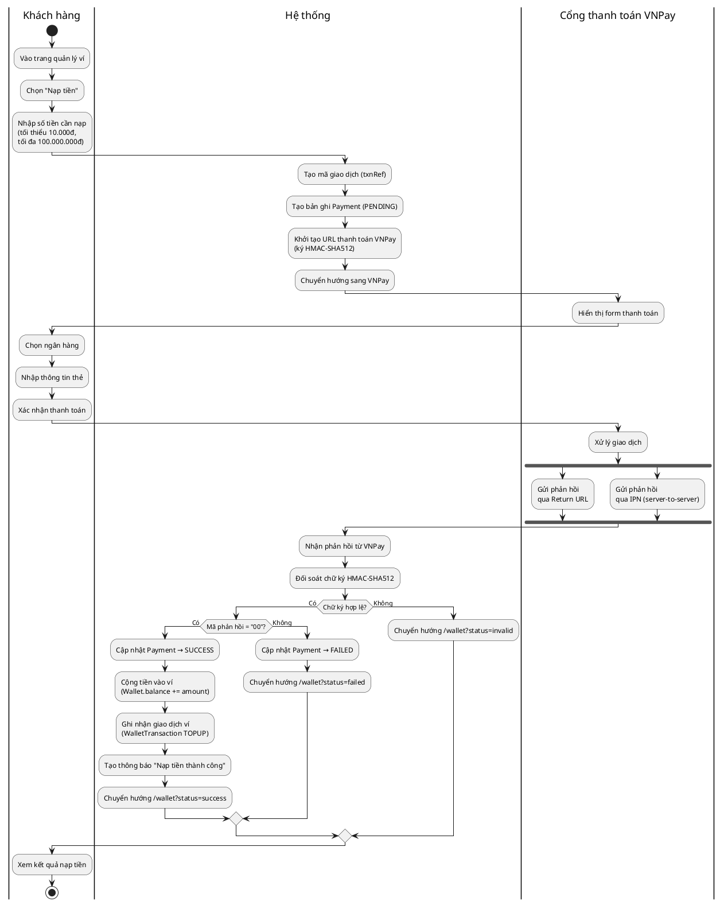

---

#### 1.5.3 Luồng quản lý bảo trì

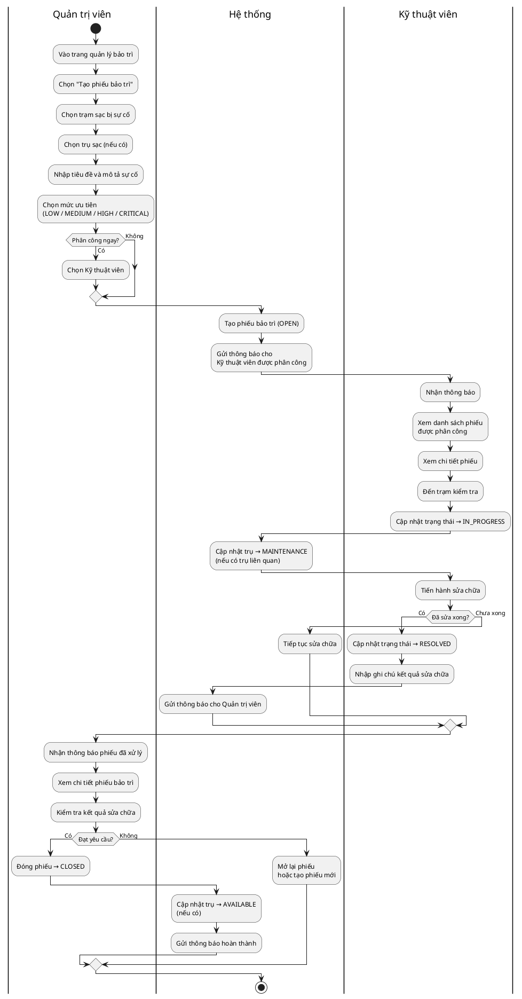

---

#### 1.5.4 Luồng Bộ định thời — Tự động hủy đặt chỗ quá hạn

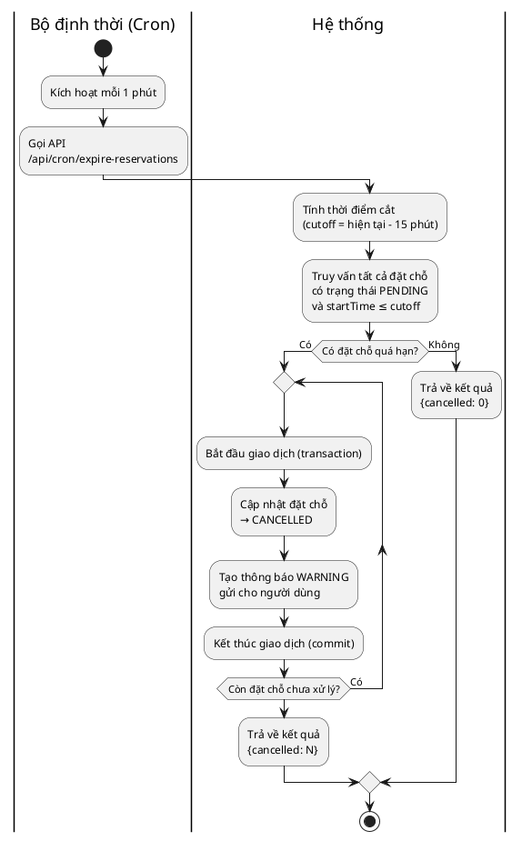

---

## 2. BIỂU ĐỒ TRÌNH TỰ — SEQUENCE DIAGRAMS

> **Quy uoc:**
> - Lifeline: **Actor -> UI -> API -> DB -> He thong ngoai**.
> - **Activation Bar (thanh kich hoat):**
>   - **Actor**: khong co
>   - **UI**: co — bat dau khi hien thi ket qua cho Actor
>   - **API**: co — bat dau khi xu ly response, ket thuc khi tra response
>   - **DB**: co (ngan) — bat dau khi nhan query, ket thuc khi tra du lieu
>   - **He thong ngoai (Push, VNPay)**: co
> - **`activate`/`deactivate` nam TRON trong cung 1 nhanh `alt`** — moi nhanh tu quan ly rieng

---

### 2.1 Dang ky tai khoan

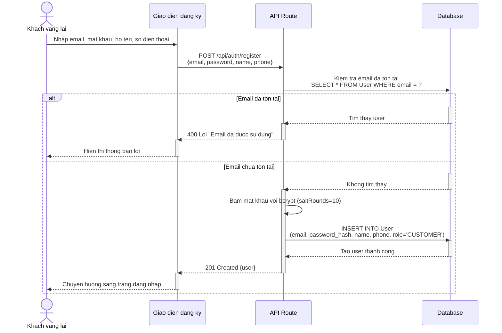

---

### 2.2 Dang nhap

```mermaid
sequenceDiagram
  actor Guest as Khach vang lai
  participant UI as Giao dien dang nhap
  participant API as API Route
  participant DB as Database

  Guest->>UI: Nhap email va mat khau
  UI->>API: POST /api/auth/login<br/>{email, password}
  API->>DB: Tim user theo email<br/>SELECT * FROM User WHERE email = ?

  alt Email khong ton tai
    activate DB
    DB-->>API: Khong tim thay
    deactivate DB
    activate API
    API-->>UI: 401 "Email hoac mat khau khong dung"
    deactivate API
    activate UI
    UI-->>Guest: Hien thi thong bao loi
    deactivate UI
  else Email ton tai
    activate DB
    DB-->>API: Tra ve user {id, email, password_hash, role}
    deactivate DB
    activate API
    API->>API: So sanh mat khau voi bcrypt.compare()

    alt Sai mat khau
      API-->>UI: 401 "Email hoac mat khau khong dung"
      deactivate API
      activate UI
      UI-->>Guest: Hien thi thong bao loi
      deactivate UI
    else Dung mat khau
      API->>API: Tao JWT token {id, email, role}<br/>Thoi han 7 ngay
      API-->>UI: 200 OK + Set-Cookie: ev_token=JWT
      deactivate API
      activate UI
      UI-->>Guest: Chuyen huong ve trang chu
      deactivate UI
    end
  end
```

---

### 2.3 Tim kiem tram sac gan day

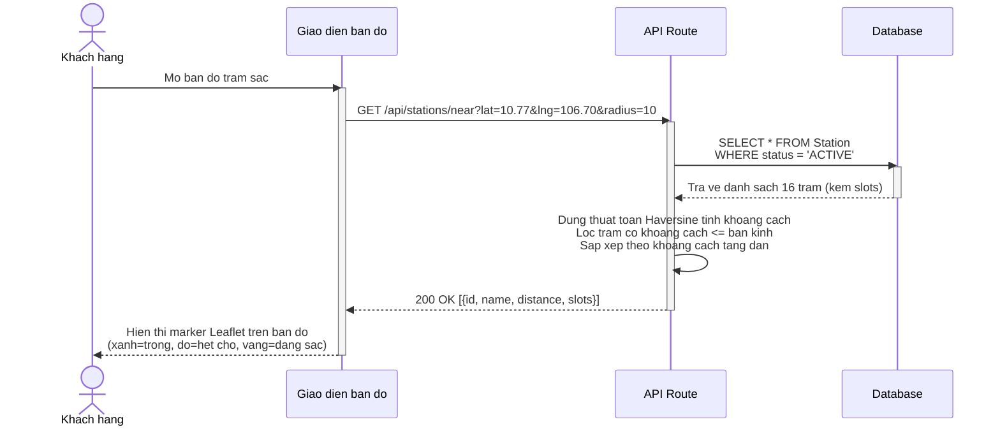

---

### 2.4 Dat cho va kiem tra trung khung gio

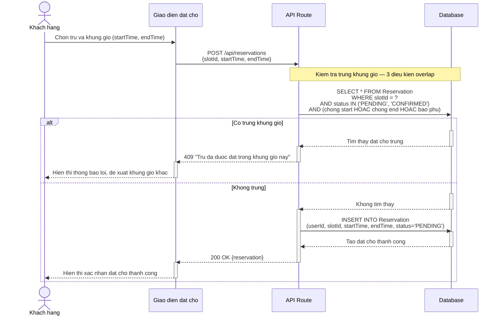

---

### 2.5 Dat cho lap lai (Recurring Reservation)

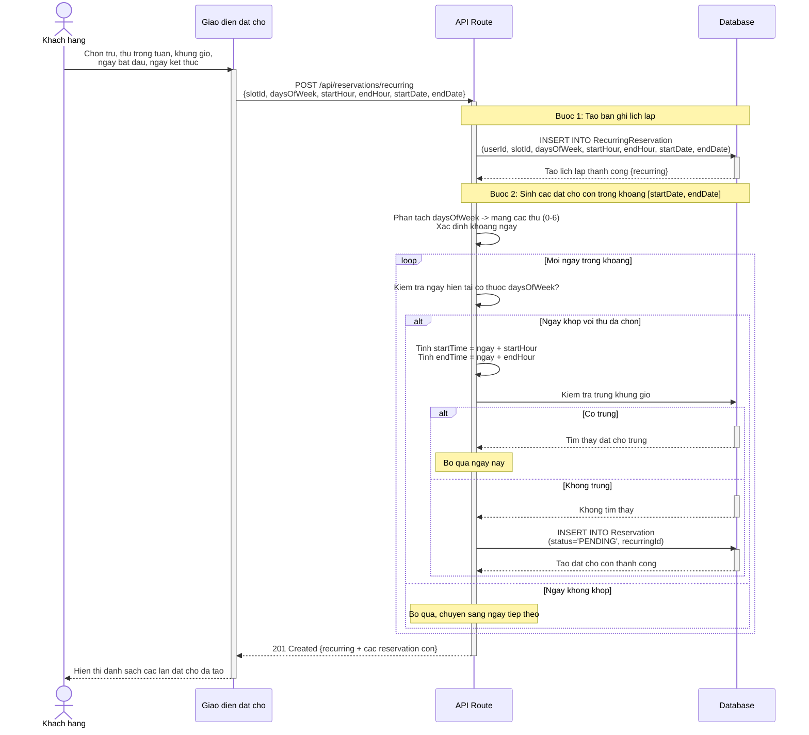

---

### 2.6 Check-in tai tram va bat dau phien sac

```mermaid
sequenceDiagram
  actor Cust as Khach hang
  participant UI as Giao dien dat cho
  participant API as API Route
  participant DB as Database
  participant Push as Dich vu thong bao day

  Cust->>UI: Nhan nut "Check-in" hoac quet ma QR
  UI->>API: POST /api/reservations/{id}/checkin
  API->>DB: SELECT * FROM Reservation<br/>WHERE id = ? AND userId = ?

  alt Qua han check-in (now > startTime + 15 phut)
    activate DB
    DB-->>API: Tra ve dat cho (PENDING, startTime)
    deactivate DB

    activate API
    API->>API: Tinh deadline = startTime + 15 phut<br/>Xac nhan now > deadline

    API->>DB: UPDATE Reservation SET status = 'CANCELLED'
    activate DB
    API->>DB: INSERT INTO Notification<br/>(userId, "Lich dat bi huy", type='WARNING')
    DB-->>API: Da huy
    deactivate DB
    API-->>UI: 400 "Qua 15 phut, dat cho da bi huy"
    deactivate API
    activate UI
    UI-->>Cust: Hien thi thong bao qua han
    deactivate UI
  else Trong thoi han check-in
    activate DB
    DB-->>API: Tra ve dat cho (PENDING, startTime)
    deactivate DB

    activate API
    API->>API: Tinh deadline = startTime + 15 phut<br/>Xac nhan now <= deadline

    API->>DB: UPDATE Reservation SET status = 'CONFIRMED'
    activate DB
    API->>DB: INSERT INTO ChargingSession<br/>(userId, slotId, reservationId, startTime=now, status='ACTIVE')
    API->>DB: UPDATE Slot SET status = 'OCCUPIED'
    DB-->>API: Hoan tat
    deactivate DB

    API->>Push: Gui thong bao "Phien sac bat dau"
    activate Push
    Push-->>Cust: Hien thi thong bao tren trinh duyet
    deactivate Push

    API-->>UI: 200 OK {reservation: CONFIRMED, session: ACTIVE}
    deactivate API
    activate UI
    UI-->>Cust: Hien thi man hinh theo doi phien sac
    deactivate UI
  end
```

---

### 2.7 Cron — Tu dong huy dat cho qua han

```mermaid
sequenceDiagram
  participant Cron as Bo dinh thoi (chay moi 1 phut)
  participant API as API Route
  participant DB as Database
  participant Notify as Dich vu thong bao day

  Note over Cron,DB: Kich hoat tu dong moi 60 giay

  Cron->>API: GET /api/cron/expire-reservations
  activate API
  API->>API: Tinh cutoff = now() - 15 phut

  API->>DB: SELECT * FROM Reservation<br/>WHERE status = 'PENDING'<br/>AND startTime <= cutoff

  alt Khong co dat cho qua han
    activate DB
    DB-->>API: Khong co ket qua
    deactivate DB
    API-->>Cron: 200 OK {cancelled: 0, checkedAt}
    deactivate API
  else Co dat cho qua han
    activate DB
    DB-->>API: Tra ve danh sach dat cho qua han
    deactivate DB

    loop Moi dat cho qua han
      API->>DB: BEGIN TRANSACTION
      activate DB
      API->>DB: UPDATE Reservation SET status = 'CANCELLED'
      API->>DB: INSERT INTO Notification<br/>(userId, "Lich dat bi huy", type='WARNING')
      API->>DB: COMMIT
      DB-->>API: Da huy + tao thong bao
      deactivate DB

      API->>Notify: Gui thong bao day (Web Push) cho nguoi dung
      activate Notify
      Notify-->>Notify: Web Push API gui den trinh duyet
      deactivate Notify
    end

    API-->>Cron: 200 OK {cancelled: N, checkedAt}
    deactivate API
  end
```

---

### 2.8 Ket thuc phien sac — Tinh cuoc va lap hoa don

```mermaid
sequenceDiagram
  actor Cust as Khach hang
  participant UI as Giao dien phien sac
  participant API as API Route
  participant DB as Database
  participant Notify as Dich vu thong bao

  Cust->>UI: Nhan "Ket thuc sac"
  activate UI
  UI->>API: POST /api/sessions/{id}/stop
  activate API
  API->>DB: SELECT session + slot + user + fleet<br/>WHERE session.id = ?
  activate DB
  DB-->>API: Tra ve session (ACTIVE) + slot.powerKw + user.fleet
  deactivate DB

  Note over API: === TINH TOAN ===
  API->>API: endTime = now()<br/>durationHours = (endTime - startTime) / 3600000<br/>energyKwh = durationHours x powerKw x 0.9

  API->>DB: SELECT * FROM Tariff<br/>WHERE active = 1 AND startHour <= h < endHour<br/>ORDER BY isPeak DESC
  activate DB
  DB-->>API: Tra ve bieu gia {ratePerKwh, isPeak}
  deactivate DB

  API->>API: subtotal = energyKwh x ratePerKwh

  opt La Tai xe doi xe (co fleet)
    API->>API: fleetDiscount = subtotal x fleet.discountRate / 100<br/>amount = subtotal - fleetDiscount
  end

  API->>API: pointsEarned = floor(amount / 10000)<br/>newTier = tinh hang thanh vien tu tong diem

  Note over API,DB: === TRANSACTION (atomic) ===
  API->>DB: BEGIN TRANSACTION
  activate DB
  API->>DB: UPDATE ChargingSession SET status='COMPLETED', endTime, energyKwh
  API->>DB: UPDATE Slot SET status='AVAILABLE'
  API->>DB: INSERT INTO Invoice (sessionId, userId, energyKwh, subtotal, discount, amount, pointsEarned)
  API->>DB: UPDATE User SET loyaltyPoints += pointsEarned, loyaltyTier = newTier
  API->>DB: INSERT INTO LoyaltyTransaction (type='EARN', points, balance)
  API->>DB: COMMIT
  DB-->>API: Giao dich thanh cong
  deactivate DB

  API->>Notify: Gui thong bao "Phien sac ket thuc"<br/>+ kWh, so tien, diem thuong
  activate Notify
  Notify-->>Cust: Hien thi thong bao
  deactivate Notify

  API-->>UI: 200 OK {session, invoice, pointsEarned, fleetDiscount}
  deactivate API
  UI-->>Cust: Hien thi ket qua va hoa don
  deactivate UI
```

---

### 2.9 Thanh toan hoa don bang vi (co ap ma giam gia)

```mermaid
sequenceDiagram
  actor Cust as Khach hang
  participant UI as Giao dien hoa don
  participant API as API Route
  participant VLib as Kiem tra voucher
  participant DB as Database

  Cust->>UI: Mo hoa don can thanh toan
  activate UI
  UI->>API: GET /api/invoices/{id}
  activate API
  API->>DB: SELECT * FROM Invoice WHERE id = ?
  activate DB
  DB-->>API: Tra ve hoa don (UNPAID, amount=85.000d)
  deactivate DB
  API-->>UI: Hien thi chi tiet hoa don
  deactivate API
  deactivate UI

  opt Nguoi dung nhap ma giam gia
    Cust->>UI: Nhap ma "WELCOME50"
    activate UI
    UI->>API: POST /api/invoices/{id}/pay<br/>{method:"wallet", voucherCode:"WELCOME50"}
    activate API

    API->>VLib: validateAndCalculate("WELCOME50", userId, 85000)
    activate VLib
    VLib->>DB: SELECT * FROM Voucher WHERE code = 'WELCOME50'
    activate DB
    DB-->>VLib: voucher {type:PERCENT, value:50, maxDiscount:50000}
    deactivate DB

    VLib->>VLib: Kiem tra: active? con han?<br/>chua het usageLimit?<br/>user chua vuot perUserLimit?<br/>amount >= minAmount?

    alt Ma khong hop le
      VLib-->>API: {valid: false, error: "..."}
      deactivate VLib
      API-->>UI: 400 Ma khong hop le
      deactivate API
      UI-->>Cust: Hien thi loi
      deactivate UI
    else Ma hop le
      VLib->>VLib: discount = min(85000 x 50%, 50000) = 42.500d
      VLib-->>API: {valid: true, discount: 42500, voucher}
      deactivate VLib
      API->>API: finalAmount = 85000 - 42500 = 42.500d
      deactivate API
      deactivate UI
    end
  end

  Cust->>UI: Chon thanh toan bang vi
  activate UI
  UI->>API: POST /api/invoices/{id}/pay<br/>{method:"wallet"}
  activate API
  API->>DB: SELECT * FROM Wallet WHERE userId = ?
  activate DB
  DB-->>API: wallet {balance: 100.000d}
  deactivate DB

  alt So du khong du
    API-->>UI: 400 "So du vi khong du de thanh toan"
    deactivate API
    UI-->>Cust: Hien thi thong bao, de xuat nap them tien
    deactivate UI
  else So du du
    Note over API,DB: TRANSACTION
    API->>DB: BEGIN TRANSACTION
    activate DB
    API->>DB: UPDATE Wallet SET balance = 100000 - 42500
    API->>DB: INSERT INTO WalletTransaction (type='PAYMENT', amount=-42500)
    API->>DB: UPDATE Invoice SET status='PAID', paymentMethod='WALLET', discount=42500
    API->>DB: UPDATE Voucher SET usedCount += 1
    API->>DB: INSERT INTO VoucherUsage
    API->>DB: COMMIT
    DB-->>API: Giao dich thanh cong
    deactivate DB

    API-->>UI: 200 OK {success, finalAmount: 42500, discount: 42500}
    deactivate API
    UI-->>Cust: Hien thi "Thanh toan thanh cong"
    deactivate UI
  end
```

---

### 2.10 Nap tien qua cong thanh toan VNPay

```mermaid
sequenceDiagram
  actor Cust as Khach hang
  participant UI as Giao dien vi
  participant API as API Route
  participant VNPay as VNPay Sandbox
  participant DB as Database

  Cust->>UI: Chon "Nap tien", nhap so tien 100.000d
  activate UI
  UI->>API: POST /api/payments/vnpay/create<br/>{amount: 100000}
  activate API

  API->>API: Tao txnRef = "EV" + timestamp + random<br/>Lay IP tu x-forwarded-for

  API->>DB: INSERT INTO Payment<br/>(userId, txnRef, amount, status='PENDING', provider='VNPAY')
  activate DB
  DB-->>API: Tao payment thanh cong
  deactivate DB

  API->>API: Xay dung URL thanh toan VNPay<br/>Sap xep tham so + ky HMAC-SHA512

  API-->>UI: 200 OK {paymentUrl}
  deactivate API

  UI->>VNPay: Chuyen huong den VNPay Sandbox
  deactivate UI

  Note over Cust,VNPay: NGUOI DUNG THANH TOAN TAI VNPAY

  Cust->>VNPay: Chon ngan hang, nhap thong tin the, xac nhan
  activate VNPay
  VNPay->>VNPay: Xu ly thanh toan (sandbox)
  VNPay-->>API: GET /api/payments/vnpay/return<br/>?vnp_Amount=10000000&vnp_ResponseCode=00<br/>&vnp_TxnRef=EV...&vnp_SecureHash=...
  deactivate VNPay

  Note over API: XU LY PHAN HOI

  activate API
  API->>API: verifyVNPayReturn(queryParams)<br/>Tach SecureHash -> sap xep params -> HMAC-SHA512 -> so sanh

  alt Chu ky khong hop le
    API-->>UI: Redirect /wallet?status=invalid
    deactivate API
    activate UI
    UI-->>Cust: Hien thi "Giao dich khong hop le"
    deactivate UI
  else Chu ky hop le
    API->>DB: SELECT * FROM Payment WHERE txnRef = ?
    activate DB
    DB-->>API: payment {PENDING}
    deactivate DB

    alt Ma phan hoi = "00" (Thanh cong)
      API->>DB: BEGIN TRANSACTION
      activate DB
      API->>DB: UPDATE Payment SET status='SUCCESS', responseCode, bankCode, paidAt
      API->>DB: INSERT OR UPDATE Wallet SET balance += 100000
      API->>DB: INSERT INTO WalletTransaction (type='TOPUP', amount=+100000)
      API->>DB: INSERT INTO Notification ("Nap tien thanh cong")
      API->>DB: COMMIT
      DB-->>API: Giao dich thanh cong
      deactivate DB

      API-->>UI: Redirect /wallet?status=success&amount=100000
      deactivate API
      activate UI
      UI-->>Cust: Hien thi "Nap tien thanh cong"
      deactivate UI
    else Ma phan hoi khac "00" (That bai)
      API->>DB: UPDATE Payment SET status='FAILED', responseCode
      activate DB
      DB-->>API: Da cap nhat
      deactivate DB

      API-->>UI: Redirect /wallet?status=failed
      deactivate API
      activate UI
      UI-->>Cust: Hien thi "Thanh toan that bai"
      deactivate UI
    end
  end
```

---

### 2.11 Quan ly bao tri — Phan cong va xu ly

```mermaid
sequenceDiagram
  actor Admin as Quan tri vien
  actor Tech as Ky thuat vien
  participant UI as Giao dien quan tri
  participant API as API Route
  participant DB as Database
  participant Notify as Dich vu thong bao

  Note over Admin,DB: === QUAN TRI VIEN TAO PHIEU BAO TRI ===

  Admin->>UI: Nhap: tram, tru, tieu de, mo ta, muc uu tien, ky thuat vien
  activate UI
  UI->>API: POST /api/maintenance<br/>{stationId, slotId?, title, description, priority, assignedToId?}
  activate API
  API->>DB: INSERT INTO MaintenanceTicket<br/>(stationId, title, priority, status='OPEN', createdById, assignedToId)
  activate DB
  DB-->>API: Tao phieu bao tri thanh cong
  deactivate DB

  opt Co phan cong ky thuat vien
    API->>Notify: Gui thong bao "Phieu bao tri moi"
    activate Notify
    Notify-->>Tech: Hien thi thong bao
    deactivate Notify
  end

  API-->>UI: 201 Created {ticket}
  deactivate API
  UI-->>Admin: Hien thi phieu bao tri da tao
  deactivate UI

  Note over Tech,DB: === KY THUAT VIEN XU LY ===

  Tech->>UI: Mo danh sach phieu duoc phan cong
  activate UI
  UI->>API: GET /api/maintenance
  activate API
  API->>DB: SELECT * FROM MaintenanceTicket<br/>WHERE assignedToId = ?
  activate DB
  DB-->>API: Danh sach phieu
  deactivate DB

  loop Voi moi phieu can xu ly
    API-->>UI: Tra ve danh sach
    UI-->>Tech: Hien thi danh sach

    Tech->>UI: Chon phieu -> "Bat dau sua"
    UI->>API: PATCH /api/maintenance/{id}<br/>{status: "IN_PROGRESS"}
    API->>DB: UPDATE MaintenanceTicket SET status='IN_PROGRESS'
    activate DB

    opt Co tru lien quan
      API->>DB: UPDATE Slot SET status='MAINTENANCE'
    end

    DB-->>API: Cap nhat thanh cong
    deactivate DB

    Tech->>UI: Sau khi sua xong, nhap ghi chu
    UI->>API: PATCH /api/maintenance/{id}<br/>{status: "RESOLVED", note: "Da thay module sac"}
    API->>DB: UPDATE MaintenanceTicket SET status='RESOLVED'
    activate DB
    DB-->>API: Cap nhat thanh cong
    deactivate DB

    API->>Notify: Gui thong bao "Phieu bao tri da xu ly"
    activate Notify
    Notify-->>Admin: Hien thi thong bao
    deactivate Notify
  end
  deactivate API
  deactivate UI

  Note over Admin,DB: === QUAN TRI VIEN DONG PHIEU ===

  Admin->>UI: Kiem tra phieu da RESOLVED -> "Dong phieu"
  activate UI
  UI->>API: PATCH /api/maintenance/{id}<br/>{status: "CLOSED"}
  activate API
  API->>DB: UPDATE MaintenanceTicket<br/>SET status='CLOSED', resolvedAt=now
  activate DB

  opt Co tru lien quan
    API->>DB: UPDATE Slot SET status='AVAILABLE'
  end

  DB-->>API: Dong phieu thanh cong
  deactivate DB

  API->>Notify: Gui thong bao "Phieu bao tri da dong"
  activate Notify
  Notify-->>Tech: Hien thi thong bao
  deactivate Notify

  API-->>UI: 200 OK {ticket}
  deactivate API
  UI-->>Admin: Hien thi phieu da dong
  deactivate UI
```

```

---

## 3. BIỂU ĐỒ LỚP CHI TIẾT — CLASS DIAGRAM

> **Quy ước:**
> - Dùng cú pháp **Mermaid classDiagram**.
> - Mỗi model Prisma ≡ 1 class.
> - Các quan hệ (1-1, 1-N, N-N) được ánh xạ từ khóa ngoại trong schema.
> - Class Diagram **chỉ mô tả cấu trúc dữ liệu và quan hệ**, không mô tả luồng xử lý.

---

### 3.1 Sơ đồ tổng thể (22 lớp)

```mermaid
classDiagram
    direction TB

    %% ═══════════════ CORE DOMAIN ═══════════════
    class User {
        +String id PK
        +String email UK
        +String password
        +String name
        +String phone
        +String avatar
        +String role «CUSTOMER/DRIVER/TECHNICIAN/ADMIN»
        +Int loyaltyPoints
        +String loyaltyTier «BRONZE/SILVER/GOLD/PLATINUM»
        +String theme «light/dark»
        +DateTime createdAt
        +DateTime updatedAt
    }

    class Station {
        +String id PK
        +String name
        +String address
        +String city
        +String district
        +Float lat
        +Float lng
        +String status «ACTIVE/INACTIVE»
        +Float rating
        +Int reviewCount
        +String brand
        +Boolean isPremium
        +String imageUrl
        +String amenities
        +String description
        +DateTime createdAt
    }

    class Slot {
        +String id PK
        +String slotNumber
        +String connectorType «CCS2/Type2/CHAdeMO/GB/T»
        +Float powerKw
        +String status «AVAILABLE/OCCUPIED/CHARGING/MAINTENANCE»
        +String qrCode UK
        +String stationId FK
        +String lastError
        +DateTime lastHeartbeat
    }

    class Reservation {
        +String id PK
        +String userId FK
        +String slotId FK
        +DateTime startTime
        +DateTime endTime
        +String status «PENDING/CONFIRMED/CANCELLED/COMPLETED»
        +String recurringId FK
    }

    class RecurringReservation {
        +String id PK
        +String userId FK
        +String slotId FK
        +String daysOfWeek
        +Int startHour
        +Int endHour
        +DateTime startDate
        +DateTime endDate
        +Boolean active
    }

    class ChargingSession {
        +String id PK
        +String userId FK
        +String slotId FK
        +String reservationId UK FK
        +DateTime startTime
        +DateTime endTime
        +Float energyKwh
        +String status «ACTIVE/COMPLETED/CANCELLED»
    }

    %% ═══════════════ BILLING ═══════════════
    class Invoice {
        +String id PK
        +String invoiceNo UK
        +String sessionId UK FK
        +String userId FK
        +Float energyKwh
        +Float subtotal
        +Float discount
        +String voucherCode
        +Float amount
        +Int pointsEarned
        +Int pointsRedeemed
        +String status «UNPAID/PAID»
        +DateTime paidAt
        +String paymentMethod
    }

    class Tariff {
        +String id PK
        +String name
        +Int startHour
        +Int endHour
        +Float ratePerKwh
        +Boolean isPeak
        +Boolean active
    }

    %% ═══════════════ WALLET & PAYMENT ═══════════════
    class Wallet {
        +String id PK
        +String userId UK FK
        +Float balance
        +DateTime createdAt
    }

    class WalletTransaction {
        +String id PK
        +String userId FK
        +String type «TOPUP/PAYMENT/REDEEM/ADJUST»
        +Float amount
        +Float balance
        +String note
        +String paymentId
    }

    class Payment {
        +String id PK
        +String userId FK
        +String txnRef UK
        +Float amount
        +String status «PENDING/SUCCESS/FAILED»
        +String provider
        +String responseCode
        +String bankCode
        +String bankTranNo
        +String ipAddress
        +DateTime paidAt
    }

    %% ═══════════════ LOYALTY & VOUCHER ═══════════════
    class LoyaltyTransaction {
        +String id PK
        +String userId FK
        +String type «EARN/REDEEM/ADJUST»
        +Int points
        +Int balance
        +String reason
    }

    class Voucher {
        +String id PK
        +String code UK
        +String name
        +String type «PERCENT/FIXED»
        +Float value
        +Float minAmount
        +Float maxDiscount
        +Int usageLimit
        +Int perUserLimit
        +DateTime validFrom
        +DateTime validUntil
        +Boolean active
        +Int usedCount
    }

    class VoucherUsage {
        +String id PK
        +String voucherId FK
        +String userId FK
        +String invoiceId
        +Float discount
    }

    %% ═══════════════ MAINTENANCE ═══════════════
    class MaintenanceTicket {
        +String id PK
        +String stationId FK
        +String slotId FK
        +String title
        +String description
        +String priority «LOW/MEDIUM/HIGH/CRITICAL»
        +String status «OPEN/IN_PROGRESS/RESOLVED/CLOSED»
        +String createdById FK
        +String assignedToId FK
        +DateTime resolvedAt
    }

    %% ═══════════════ REVIEW ═══════════════
    class Review {
        +String id PK
        +String userId FK
        +String stationId FK
        +Int rating
        +String comment
        +Boolean verified
        +DateTime createdAt
    }

    %% ═══════════════ NOTIFICATION & PUSH ═══════════════
    class Notification {
        +String id PK
        +String userId FK
        +String title
        +String message
        +String type «INFO/SUCCESS/WARNING/ERROR»
        +Boolean read
        +String link
    }

    class PushSubscription {
        +String id PK
        +String userId FK
        +String endpoint UK
        +String p256dh
        +String auth
        +String userAgent
    }

    %% ═══════════════ FLEET & VEHICLE ═══════════════
    class Fleet {
        +String id PK
        +String name
        +String code UK
        +String contact
        +String phone
        +String email
        +Int vehicleCount
        +Boolean walletShared
        +Float discountRate
        +Boolean active
    }

    class Vehicle {
        +String id PK
        +String userId FK
        +String fleetId FK
        +String brand
        +String model
        +String licensePlate UK
        +String connectorType
        +Float batteryKwh
        +String vinNumber
        +Boolean active
    }

    %% ═══════════════ WEBHOOK & API KEY ═══════════════
    class Webhook {
        +String id PK
        +String name
        +String url
        +String events
        +String secret
        +Boolean active
        +DateTime lastTriggered
        +Int failureCount
    }

    class WebhookLog {
        +String id PK
        +String webhookId FK
        +String event
        +String payload
        +Int responseStatus
        +String responseBody
        +Boolean success
    }

    class ApiKey {
        +String id PK
        +String name
        +String key UK
        +String partnerId
        +Boolean active
        +DateTime lastUsed
        +Int rateLimit
    }

    %% ═══════════════ QUAN HỆ ═══════════════
    %% User → con
    User "1" --> "0..*" Reservation : có
    User "1" --> "0..*" RecurringReservation : có
    User "1" --> "0..*" ChargingSession : thực hiện
    User "1" --> "0..*" Invoice : có
    User "1" --> "0..1" Wallet : sở hữu
    User "1" --> "0..*" WalletTransaction : có
    User "1" --> "0..*" Notification : nhận
    User "1" --> "0..*" Review : viết
    User "1" --> "0..*" LoyaltyTransaction : có
    User "1" --> "0..*" Payment : tạo
    User "1" --> "0..*" VoucherUsage : sử dụng
    User "1" --> "0..*" PushSubscription : đăng ký
    User "1" --> "0..*" Vehicle : sở hữu
    User "1" --> "0..*" MaintenanceTicket : tạo

    %% Station
    Station "1" --> "0..*" Slot : chứa
    Station "1" --> "0..*" MaintenanceTicket : có
    Station "1" --> "0..*" Review : nhận

    %% Slot
    Slot "1" --> "0..*" Reservation : được đặt
    Slot "1" --> "0..*" ChargingSession : được dùng
    Slot "1" --> "0..*" MaintenanceTicket : liên quan

    %% Reservation → Session
    Reservation "1" --> "0..1" ChargingSession : sinh ra
    Reservation "0..*" --> "0..1" RecurringReservation : từ mẫu

    %% Session → Invoice
    ChargingSession "1" --> "0..1" Invoice : tạo ra

    %% Maintenance
    MaintenanceTicket "0..*" --> "1" User : "tạo bởi (createdById)"
    MaintenanceTicket "0..*" --> "0..1" User : "phân công cho (assignedToId)"
    MaintenanceTicket "0..*" --> "1" Station : tại trạm
    MaintenanceTicket "0..*" --> "0..1" Slot : tại trụ

    %% Fleet & Vehicle
    Fleet "1" --> "0..*" User : tài xế
    Fleet "1" --> "0..*" Vehicle : xe thuộc đội
    Vehicle "0..*" --> "1" User : chủ xe
    Vehicle "0..*" --> "0..1" Fleet : thuộc đội

    %% Voucher
    Voucher "1" --> "0..*" VoucherUsage : được dùng
    VoucherUsage "0..*" --> "1" User : bởi

    %% Webhook
    Webhook "1" --> "0..*" WebhookLog : ghi nhật ký
```

---

### 3.2 Phân nhóm chi tiết theo domain

#### 3.2.1 Core Business Domain

```mermaid
classDiagram
    direction TB

    class User {
        +String id PK
        +String email UK
        +String password
        +String role
        +Int loyaltyPoints
        +String loyaltyTier
    }

    class Station {
        +String id PK
        +String name
        +String address
        +Float lat
        +Float lng
        +String status
        +Float rating
    }

    class Slot {
        +String id PK
        +String slotNumber
        +String connectorType
        +Float powerKw
        +String status
        +String qrCode UK
    }

    class Reservation {
        +String id PK
        +DateTime startTime
        +DateTime endTime
        +String status
    }

    class ChargingSession {
        +String id PK
        +DateTime startTime
        +DateTime endTime
        +Float energyKwh
        +String status
    }

    class Invoice {
        +String id PK
        +String invoiceNo UK
        +Float energyKwh
        +Float subtotal
        +Float discount
        +Float amount
        +String status
        +DateTime paidAt
    }

    User "1" --> "0..*" Reservation : userId FK
    User "1" --> "0..*" ChargingSession : userId FK
    User "1" --> "0..*" Invoice : userId FK
    Station "1" --> "0..*" Slot : stationId FK
    Slot "1" --> "0..*" Reservation : slotId FK
    Slot "1" --> "0..*" ChargingSession : slotId FK
    Reservation "1" --> "0..1" ChargingSession : reservationId UK FK
    ChargingSession "1" --> "0..1" Invoice : sessionId UK FK
```

#### 3.2.2 Wallet & Payment Domain

```mermaid
classDiagram
    direction LR

    class User {
        +String id
    }

    class Wallet {
        +String id
        +Float balance
    }

    class WalletTransaction {
        +String id
        +String type
        +Float amount
        +Float balance
        +String note
    }

    class Payment {
        +String id
        +String txnRef UK
        +Float amount
        +String status
        +String provider
        +String responseCode
        +String bankCode
    }

    User "1" --> "0..1" Wallet : userId UK FK
    User "1" --> "0..*" WalletTransaction : userId FK
    User "1" --> "0..*" Payment : userId FK
```

#### 3.2.3 Loyalty & Voucher Domain

```mermaid
classDiagram
    direction LR

    class User {
        +String id
        +Int loyaltyPoints
        +String loyaltyTier
    }

    class LoyaltyTransaction {
        +String id
        +String type
        +Int points
        +Int balance
        +String reason
    }

    class Voucher {
        +String id
        +String code UK
        +String type
        +Float value
        +Float maxDiscount
        +Int usageLimit
        +Int usedCount
    }

    class VoucherUsage {
        +String id
        +Float discount
    }

    User "1" --> "0..*" LoyaltyTransaction : userId FK
    User "1" --> "0..*" VoucherUsage : userId FK
    Voucher "1" --> "0..*" VoucherUsage : voucherId FK
```

#### 3.2.4 Maintenance Domain

```mermaid
classDiagram
    direction LR

    class User {
        +String id
        +String name
        +String role
    }

    class MaintenanceTicket {
        +String id
        +String title
        +String description
        +String priority
        +String status
        +DateTime resolvedAt
    }

    class Station {
        +String id
        +String name
    }

    class Slot {
        +String id
        +String slotNumber
    }

    User "1" --> "0..*" MaintenanceTicket : "tạo (createdById FK)"
    User "1" --> "0..*" MaintenanceTicket : "được gán (assignedToId FK)"
    Station "1" --> "0..*" MaintenanceTicket : stationId FK
    Slot "1" --> "0..*" MaintenanceTicket : slotId FK
```

#### 3.2.5 Fleet & Vehicle Domain

```mermaid
classDiagram
    direction LR

    class Fleet {
        +String id
        +String name
        +String code UK
        +Float discountRate
        +Boolean active
    }

    class User {
        +String id
        +String fleetId FK
    }

    class Vehicle {
        +String id
        +String brand
        +String model
        +String licensePlate UK
        +String connectorType
    }

    Fleet "1" --> "0..*" User : fleetId FK (tài xế)
    Fleet "1" --> "0..*" Vehicle : fleetId FK (xe)
    User "1" --> "0..*" Vehicle : userId FK (chủ xe)
```

#### 3.2.6 Notification & Push Domain

```mermaid
classDiagram
    direction LR

    class User {
        +String id
    }

    class Notification {
        +String id
        +String title
        +String message
        +String type
        +Boolean read
        +String link
    }

    class PushSubscription {
        +String id
        +String endpoint UK
        +String p256dh
        +String auth
    }

    User "1" --> "0..*" Notification : userId FK
    User "1" --> "0..*" PushSubscription : userId FK
```

---

### 3.3 Bảng tổng hợp quan hệ

| STT | Từ lớp | Đến lớp | Bản số | Khóa ngoại | Ghi chú |
|-----|--------|---------|--------|------------|---------|
| 1 | User | Reservation | 1 : 0..* | userId | Một người dùng có nhiều đặt chỗ |
| 2 | User | ChargingSession | 1 : 0..* | userId | Một người dùng có nhiều phiên sạc |
| 3 | User | Invoice | 1 : 0..* | userId | Một người dùng có nhiều hóa đơn |
| 4 | User | Wallet | 1 : 0..1 | userId (unique) | Mỗi người dùng có tối đa 1 ví |
| 5 | User | WalletTransaction | 1 : 0..* | userId | Lịch sử giao dịch ví |
| 6 | User | Payment | 1 : 0..* | userId | Lịch sử thanh toán VNPay |
| 7 | User | Notification | 1 : 0..* | userId | Thông báo của người dùng |
| 8 | User | Review | 1 : 0..* | userId | Đánh giá của người dùng |
| 9 | User | LoyaltyTransaction | 1 : 0..* | userId | Lịch sử điểm thưởng |
| 10 | User | VoucherUsage | 1 : 0..* | userId | Lịch sử dùng mã giảm giá |
| 11 | User | PushSubscription | 1 : 0..* | userId | Đăng ký nhận thông báo đẩy |
| 12 | User | Vehicle | 1 : 0..* | userId | Phương tiện của người dùng |
| 13 | User | MaintenanceTicket | 1 : 0..* | createdById | Phiếu bảo trì do người dùng tạo |
| 14 | User | MaintenanceTicket | 1 : 0..* | assignedToId | Phiếu được gán cho kỹ thuật viên |
| 15 | Station | Slot | 1 : 0..* | stationId | Một trạm có nhiều trụ sạc |
| 16 | Station | MaintenanceTicket | 1 : 0..* | stationId | Phiếu bảo trì tại trạm |
| 17 | Station | Review | 1 : 0..* | stationId | Đánh giá về trạm |
| 18 | Slot | Reservation | 1 : 0..* | slotId | Một trụ được đặt nhiều lần |
| 19 | Slot | ChargingSession | 1 : 0..* | slotId | Một trụ có nhiều phiên sạc |
| 20 | Slot | MaintenanceTicket | 1 : 0..* | slotId | Phiếu bảo trì liên quan đến trụ |
| 21 | Reservation | ChargingSession | 1 : 0..1 | reservationId (unique) | Một đặt chỗ sinh ra tối đa 1 phiên sạc |
| 22 | Reservation | RecurringReservation | 0..* : 0..1 | recurringId | Đặt chỗ được tạo từ lịch lặp |
| 23 | ChargingSession | Invoice | 1 : 0..1 | sessionId (unique) | Một phiên sạc có tối đa 1 hóa đơn |
| 24 | Voucher | VoucherUsage | 1 : 0..* | voucherId | Một mã giảm giá được dùng nhiều lần |
| 25 | Fleet | User | 1 : 0..* | fleetId | Một đội xe có nhiều tài xế |
| 26 | Fleet | Vehicle | 1 : 0..* | fleetId | Một đội xe có nhiều phương tiện |
| 27 | Vehicle | User | 0..* : 1 | userId | Một phương tiện thuộc về một người dùng |
| 28 | Vehicle | Fleet | 0..* : 0..1 | fleetId | Một phương tiện có thể thuộc đội xe |
| 29 | Webhook | WebhookLog | 1 : 0..* | webhookId | Nhật ký gọi webhook |
| 30 | Review | (User, Station) | unique | (userId, stationId) | Mỗi người dùng chỉ 1 đánh giá mỗi trạm |

---

## 4. PHỤ LỤC: KIẾN TRÚC TỔNG THỂ

### 4.1 Sơ đồ kiến trúc phân tầng

```
┌─────────────────────────────────────────────────────────────────┐
│                       TRÌNH DUYỆT (CLIENT)                       │
│  ┌──────────┐ ┌───────────┐ ┌──────────────┐ ┌──────────────┐  │
│  │ Giao diện│ │ Giao diện │ │ Giao diện    │ │ Giao diện    │  │
│  │ Khách    │ │ Tài xế    │ │ Kỹ thuật viên│ │ Quản trị viên│  │
│  │ hàng     │ │ đội xe    │ │              │ │              │  │
│  └────┬─────┘ └─────┬─────┘ └──────┬───────┘ └──────┬───────┘  │
│       └─────────────┴──────────────┴───────────────┘            │
│                         │ JWT Cookie                             │
└─────────────────────────┼───────────────────────────────────────┘
                          │ HTTPS
┌─────────────────────────┼───────────────────────────────────────┐
│                 NEXT.JS 14 APP ROUTER (SERVER)                    │
│  ┌──────────────────────┴──────────────────────────────────┐    │
│  │                   TẦNG API ROUTES                        │    │
│  │  /api/auth/*        /api/stations/*   /api/sessions/*    │    │
│  │  /api/reservations/* /api/invoices/*  /api/wallet/*      │    │
│  │  /api/payments/*     /api/loyalty/*   /api/maintenance/* │    │
│  │  /api/admin/*        /api/cron/*      /api/webhooks/*    │    │
│  └──────────────────────┬──────────────────────────────────┘    │
│  ┌──────────────────────┴──────────────────────────────────┐    │
│  │                  TẦNG BUSINESS LOGIC                      │    │
│  │  auth.ts (JWT)    vnpay.ts (HMAC)   notify.ts (Push)     │    │
│  │  voucher.ts       prisma.ts (DB)    push.ts (Web Push)   │    │
│  └──────────────────────┬──────────────────────────────────┘    │
└─────────────────────────┼───────────────────────────────────────┘
                          │
┌─────────────────────────┼───────────────────────────────────────┐
│              PRISMA ORM (Adapter: LibSQL)                        │
│  ┌──────────────────────┴──────────────────────────────────┐    │
│  │            schema.prisma (22 models, 30 quan hệ)         │    │
│  └──────────────────────┬──────────────────────────────────┘    │
└─────────────────────────┼───────────────────────────────────────┘
                          │
┌─────────────────────────┼───────────────────────────────────────┐
│                     SQLite (dev.db)                              │
│  22 bảng, FK constraints, unique indexes, seed data             │
└─────────────────────────────────────────────────────────────────┘

   Hệ thống bên ngoài:
   ┌──────────────┐  ┌───────────────┐  ┌──────────────────┐
   │ Cổng thanh   │  │ Dịch vụ thông │  │ Bộ định thời     │
   │ toán VNPay   │  │ báo đẩy (Web  │  │ (Cron job)       │
   │ (Sandbox)    │  │ Push API)     │  │ Mỗi 1 phút       │
   └──────────────┘  └───────────────┘  └──────────────────┘
```

### 4.2 Công nghệ sử dụng

| Tầng | Công nghệ | Mục đích |
|------|-----------|----------|
| Framework | Next.js 14 (App Router) | Full-stack web framework |
| Ngôn ngữ | TypeScript | Type safety toàn bộ dự án |
| ORM | Prisma 7 + libSQL adapter | Truy xuất dữ liệu type-safe |
| Cơ sở dữ liệu | SQLite | Lưu trữ (môi trường phát triển) |
| Xác thực | JWT (jsonwebtoken) + bcryptjs | Xác thực không trạng thái |
| Thanh toán | VNPay Sandbox (HMAC-SHA512) | Nạp tiền vào ví điện tử |
| Bản đồ | Leaflet + OpenStreetMap | Hiển thị vị trí trạm sạc |
| Giao diện | Tailwind CSS | Thiết kế responsive |
| Thông báo đẩy | Web Push API (VAPID) | Thông báo tới trình duyệt |
| Tự động hóa | Cron jobs (mỗi 1 phút) | Hủy đặt chỗ quá hạn, nhắc lịch |

### 4.3 Tổng kết chỉ số

| Chỉ số | Giá trị |
|--------|---------|
| Số lượng lớp (Entity) | **22** |
| Số lượng quan hệ | **30** |
| Số lượng API Route | **~75 endpoints** |
| Số lượng Use Case | **82** (bao gồm cả UC nội bộ <<include>>) |
| Số lượng Actor | **8** (5 primary + 3 secondary) |
| Số nhóm chức năng | **12** (A → L) |
| Số trang giao diện | **25+ pages** |
| Số Sequence Diagram | **11** (các luồng chính) |
| Số Activity Diagram | **4** (các quy trình nghiệp vụ) |
| Dữ liệu mẫu | 16 trạm sạc, 6 biểu giá, 2 đội xe, mã giảm giá... |

---

> **Tài liệu được tạo bởi Melio (Hermes Agent)**
> **Đồ án:** Hệ thống quản lý trạm sạc xe điện V-GREEN EV Charging
> **Ngày:** 09/06/2026
> **Tuân thủ:** Quy chuẩn UML (Use Case, Activity, Sequence, Class Diagram)
> **File:** `D:\ev-charging\PHAN_TICH_THIET_KE_HE_THONG.md`
